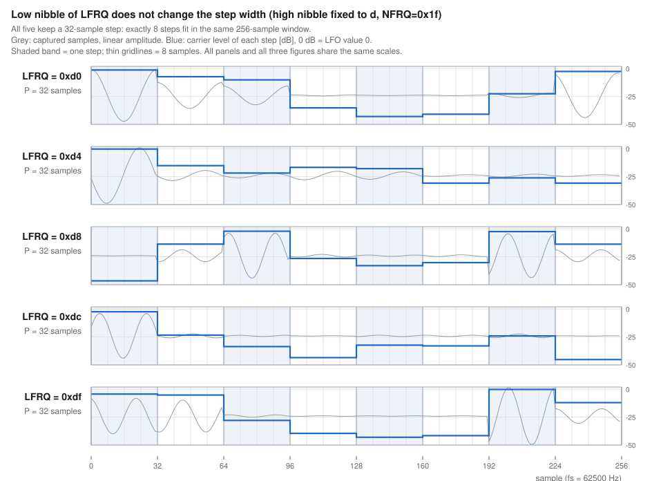
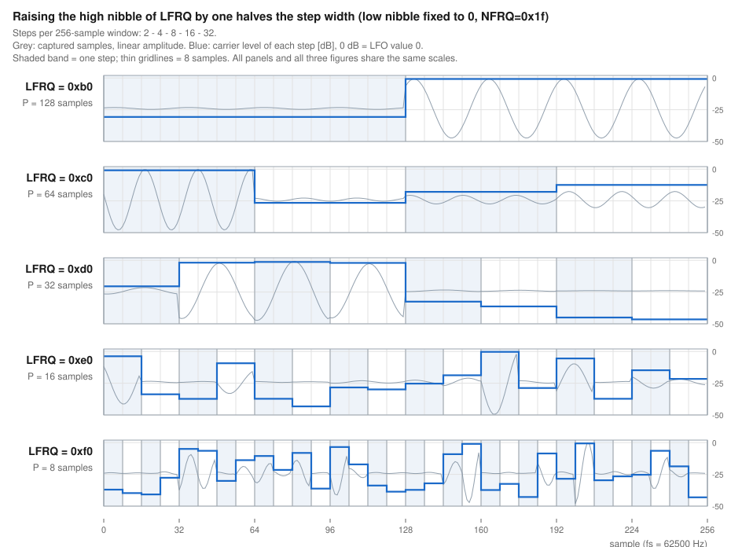
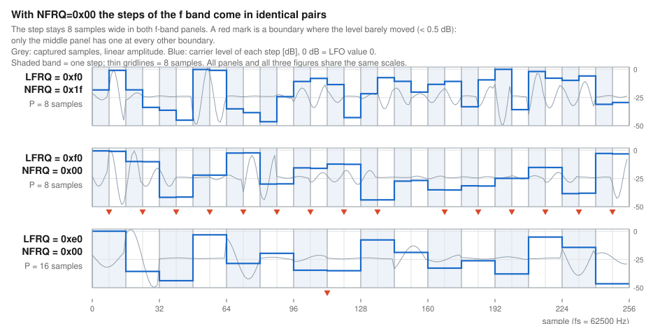

# YM2151 LFO ノイズ波形の調査

YM2151 の LFO は周波数を `LFRQ`（レジスタ `0x18`）1 バイトで指定するが、この値と実際の
LFO の速さの関係はデータシートに数値表として載っていない。さらに LFO 波形をノイズ
（`W=3`、レジスタ `0x1B`）にすると LFO の値がノイズ発生器から供給されるため、
**ノイズ周波数 `NFRQ`（レジスタ `0x0F` の下位 5bit）が LFO の挙動に関与するのか**もはっきり
しない。実機の DAC 出力をキャプチャして、この 2 点を実測で決める（測定系は
[§4.2](#42-測定系)）。

**本調査のデータは大半が `W=3`（ノイズ）固定で、以下の結論は断りがなければ W=3 についてのもの。**
ただし**更新周期の規則は W=0（鋸）/ W=2（三角）でも成り立つことを実測してある**（[§5.7](#57-w0--w2-でも更新間隔は上位ニブルだけで決まる)）。
**矩形 (`W=1`) は本調査のスコープ外**で、一次データを残すだけで解析しない（[§4.11](#411-調べていないこと-w1-矩形)）。

このドキュメントでは、**実測**（このディレクトリのデータで確かめたこと。根拠の置き場を
併記する）、**推測**（実測から導いた説明。「〜と考えられる」と書く）、**未確認**（このデータ
では決まらないこと）を書き分ける。数値の根拠はすべて `result/` にある
（[§4.5](#45-解析と集計の手順) / [§4.6](#46-段ごとの-lfo-値を取り出す解析)）。

`NFRQ` は本掃引 `wav/` では `0x00` と `0x1f` の 2 値しか振っていないが、**専用の掃引
`wav_nfrq/` `wav_nfrq_5a09/` `wav_lfrq28_nfrq/` で全 32 値を押さえてある**
（[§4.4](#44-データセット) / [§5.4](#54-nfrq-を全-32-値振る) / [§5.5.3](#553-nfrq-を全-32-値振ると-0x1f-だけが立つ)）。

## 1. 解析結果の要約

| 項目 | 結論 | 根拠 |
| --- | --- | --- |
| `LFRQ` 上位ニブルと LFO 更新周期の関係 | 更新周期 = `2^(18 - (LFRQ >> 4))` samples。1 増えるごとに半分。**上位ニブル `f`（8 samples）も含めて例外は無い** | [§3](#3-結論の根拠) `[B]`（896 条件、実測/モデル 0.9998〜1.0006）/ `[J]`（`f` 帯で 8 サンプルごとのラッチを直接確認）/ 実測波形は [§2.1](#21-更新周期は-lfrq-の上位ニブルだけで決まる) の図 2 |
| `LFRQ` 下位ニブルと LFO 更新周期の関係 | 更新周期には効かない（値を振っても変わらない） | [§3](#3-結論の根拠) `[B]`（最大/最小 ≤ 1.0067。想定モデルどおりなら 1.9375）/ 実測波形は [§2.1](#21-更新周期は-lfrq-の上位ニブルだけで決まる) の図 1 |
| `LFRQ` 下位ニブルと LFO 値列の関係 | 値列も変えない。**下位ニブル 16 値すべて**が同じ値列を出す | [§3](#3-結論の根拠) `[K]`（`a0` と `af` の値列が真の一致 100%。偶然なら 10%）/ `[P]`（16 値 × 3 セッションの 48 本で、値列がどの組になるかが下位ニブルと無関係） |
| `LFRQ` 下位ニブルと 1 回の更新で進む歩幅の関係 | 歩幅 = `(16 + (LFRQ & 0x0f)) / 16`。1 LFO 周期あたりの段数は `4096 / (16 + (LFRQ & 0x0f))` で、上位ニブルには依らない | [§3](#3-結論の根拠) `[R]`（W=0 の 128 条件すべてで段数が予測と 1 段以内） |
| ハードウェアリセットとノイズ列の関係 | リセット後のノイズ列は決定的で、別々のキャプチャで同じ列が出る | [§3](#3-結論の根拠) `[K]`（別セッションの 2 本が真の一致 100%） |
| `LFRQ` 下位ニブルと更新周期の関係（W=0 / W=2） | ノイズ以外の波形でも更新周期を変えない。規則 `2^(18 - (LFRQ >> 4))` は W=3 固有ではない | [§3](#3-結論の根拠) `[N]`（鋸・三角の AM で判別できる 150 条件すべてが一致。ymfm モデルは 0 条件） |
| `NFRQ` とノイズ語の更新周期の関係 | ノイズ発生器が新しい語を出す周期 = `(32 - NFRQ) / 2` samples | [§3](#3-結論の根拠) `[J]`（`NFRQ=0x00`〜`0x0c` を搬送波 2 種 × AM/PM の 4 系列で実測。実測/予測 0.99〜1.02。PM は `0x0f` まで）。`0x1e` までの全域は [test/noise_period/](../noise_period/README.md) |
| `LFRQ` 上位ニブルと「値が 2 段ずつ対になる」現象の関係 | 上位ニブル `2` でだけ起きる。同じ下位ニブル `8` の `0x18`（hi=1）/ `0x38`（hi=3）では起きない | [§5.5.6](#556-hi2-の帯を-nfrq0x1f-で当てると対にならない)（推定周期は 8 本とも規則どおり、段境界の変化率も 8 マス平坦） |
| `NFRQ` と「値が 1 段おきにしか変わらない」現象の関係 | `NFRQ=0x1f` でだけ起きる。`0x00`〜`0x1e` の 31 値は平坦で、傾斜も中間の値も無い | [§3](#3-結論の根拠) `[O]`（`LFRQ=0x28` × `NFRQ` 全 32 値 × AM/PM。弱い側のパリティが `0x1f` だけ AM 30% / PM 0%、他の 31 値は 79〜100%） |
| `LFRQ` 下位ニブルと「値が 2 段ずつ対になる」強さの関係 | 対になる段境界の割合は `min(lo, 16-lo)/16` で、`0x28` を頂点とする**対称な山**。どちらのパリティに寄るかは `0x27` と `0x28` のあいだで反転する | [§5.5.5](#555-下位ニブル-16-値で山とパリティの反転位置を突き合わせる)（下位ニブル全 16 値。PM の残差 RMS 5.5 pt に対し、対称でない単調モデルは 32.5 pt） |

## 2. 判明した仕様

### 2.1 更新周期は `LFRQ` の上位ニブルだけで決まる

    更新周期 = 2^22 / (16 << (LFRQ >> 4)) = 2^(18 - (LFRQ >> 4))  [samples]

**`LFRQ & 0x0f` は無視される。** fs = 62500Hz（φM / 64）。



上位ニブルを `d` に固定し、下位ニブルだけを `0` / `4` / `8` / `c` / `f` と振ったときの実測波形
（AM 測定 / L チャネル）。灰色が**キャプチャした生のサンプルそのもの**（線形の振幅）、
青が段ごとの搬送波レベル [dB]（取り出しは [§4.6](#46-段ごとの-lfo-値を取り出す解析) と同じ）。
**5 本とも搬送波のレベルが跳ぶ位置が同じ 32 サンプル格子に乗る。** レベルの値そのものが
5 本で違うのは、キャプチャごとに LFO リセットからの開始位置が違って別の区間を切り出して
いるため（値列まで一致することは [§2.3](#23-下位ニブルは値列も変えない) で別に示す）。

搬送波（`KC` / `MUL`）は `LFRQ` の帯ごとに掃引スクリプトが選ぶので、下位ニブルによって
2 種類が混ざる（[付録 B.4](#b4-kc--mul-の選び方)）。**それでも段の幅は変わらない。**
図の生成とパネルごとの波形の出どころは [§4.5 図の生成](#図の生成)。

**この式は W=3 固有ではない。** W=0（鋸）/ W=2（三角）でも同じ規則が成り立つことを
実測してある（[§5.7](#57-w0--w2-でも更新間隔は上位ニブルだけで決まる)）。下位ニブルが変えるのは更新の間隔ではなく、
**1 回の更新で LFO 値が進む量（歩幅）**である。

LFO の値が変わりうるのは、この周期おきに来る瞬間だけ。実測した更新イベントの間隔は
必ず更新周期の整数倍になり、中途半端な間隔は 1 つも出ない
（[§5.5](#55-lfrq0x28-の異常を段数-10-倍でキャプチャし直す)）。間隔が 2 倍・3 倍になる回が
あるのは、その瞬間に値がたまたま変わらず、更新が見えなかったため。

したがって次の 2 つは別の話で、本調査ではこれを分けて扱う。

| | 何が決めるか |
| --- | --- |
| **更新周期そのもの**（何サンプルおきに更新の瞬間が来るか） | `LFRQ` の上位ニブルだけ（[§3](#3-結論の根拠) `[B]`） |
| **その瞬間に値が実際に変わるかどうか** | 主にノイズ語の更新周期 `P_n`（[§2.2](#22-lfo-値が変わる間隔はノイズ語の更新周期との合成で決まる)）。加えて、`NFRQ=0x1f` かつ上位ニブル `2` の帯では `LFRQ` の下位ニブルも効く（[§2.4](#24-nfrq0x1f-かつ上位ニブル-2-では値が-2-段ずつ対になる)） |

| LFRQ 上位ニブル | 実測の更新周期 [samples] | `2^(18-上位ニブル)` |
| --- | --- | --- |
| `0` | 262144 | 262144 |
| `1` | 131072 | 131072 |
| `2` | 65536 | 65536 |
| `3` | 32768 | 32768 |
| `4` | 16384 | 16384 |
| `5` | 8192 | 8192 |
| `6` | 4096 | 4096 |
| `7` | 2048 | 2048 |
| `8` | 1024 | 1024 |
| `9` | 512 | 512 |
| `a` | 256 | 256 |
| `b` | 128 | 128 |
| `c` | 64 | 64 |
| `d` | 32 | 32 |
| `e` | 16 | 16 |
| `f` | 8 | 8 |



下位ニブルを `0` に固定して上位ニブルを `b` → `f` と上げたときの実測波形。
**同じ 256 サンプルの窓に入る段が 2 → 4 → 8 → 16 → 32 と倍々に増える。**
背景の縞が段 1 つぶんで、この表の `2^(18-上位ニブル)` と一致する。灰色の生波形を見ると、
搬送波のレベルが跳ぶのは縞の境目だけで、段の途中では動かない。

**上位ニブル `f` も例外ではない。** `NFRQ=0x00` のときこの帯だけ「値が変わる間隔」が
16 サンプルに見えるが、それは LFO が遅くなっているのではなく、ノイズ発生器が 2 回に 1 回しか
新しい語を出していないため（[§2.2](#22-lfo-値が変わる間隔はノイズ語の更新周期との合成で決まる)）。8 サンプルごとにラッチしていること自体は
実測してある（[§3](#3-結論の根拠) `[J]`）。

**この式は「更新のタイミングがどうなっているか」を書いたものであって、チップ内部で位相
カウンタがどう進んでいるかを述べたものではない**（[§6.1](#61-観測した現象とそこから言えること)）。

下位ニブルは更新周期だけでなく、**LFO が引くノイズ語の列そのものも変えない**
（[§2.3](#23-下位ニブルは値列も変えない)）。

### 2.2 LFO 値が変わる間隔はノイズ語の更新周期との合成で決まる

`NFRQ` は LFO の更新周期には一切関与しない。決めるのは**ノイズ発生器が新しい語を出す周期**で、

    ノイズ語の更新周期 P_n = (32 - NFRQ) / 2  [samples]

φM で書けば `32 × (32 - NFRQ)` サイクル（φM=4MHz で `NFRQ=0x00` → 3906.25Hz /
`0x1f` → 125kHz）。LFO は [§2.1](#21-更新周期は-lfrq-の上位ニブルだけで決まる) の更新周期 `P_lfo` ごとにこの語を取り込むだけなので、
**観測される「値が変わる間隔」はこの 2 つの合成**になる。

| | 起きること | 値が変わる間隔 |
| --- | --- | --- |
| `P_lfo >= P_n` | 更新のたびに新しい語が来ている | `P_lfo` |
| `P_lfo < P_n` | 同じ語を続けて引く更新が出る | `P_lfo` の整数倍。平均は `P_n` |

現在の測定系で `P_lfo < P_n` になるのは `LFRQ` 上位ニブル `f`（`P_lfo` = 8）の帯だけで、
ここで `NFRQ` の効果が見える。

| LFRQ | `P_lfo` | `NFRQ=0x00`（`P_n`=16）で値が変わる間隔 | `NFRQ=0x01`〜`0x1f` |
| --- | --- | --- | --- |
| `0xd0`〜`0xdf` | 32 | 32 | 32 |
| `0xe0`〜`0xef` | 16 | 16 | 16 |
| `0xf0`〜`0xff` | 8 | **16**（2 回に 1 回しか変わらない） | 8 |



`LFRQ=0xf0` を `NFRQ=0x1f`（上段）と `NFRQ=0x00`（中段）で撮り比べた実測波形。
背景の縞は 8 サンプル = `P_lfo` 1 つぶんで、**どちらも段の幅は 8 サンプルのまま**。
▼ は隣の段とレベルがほぼ同じ（差が 0.5dB 未満）だった境界で、**中段だけ 1 本おきに
規則正しく並ぶ** = 8 サンプルごとのラッチが 2 回に 1 回しか新しい語を引いていない。
下段は対照で、`e` 帯は `NFRQ=0x00` でも 16 サンプルのまま変わらない。

この偏りは窓の中だけでなくキャプチャ全体で見ても中段だけに出る。**波形の出どころ・
▼ が付く境界の割合・0.5dB という境目の決め方は [§4.5 図の生成](#図の生成)。**
同じことを閾値なしの統計で測ったのが [§5.4.2](#542-段ごとの-lfo-値から供給周期を測る) で、
こちらは奇数の連が 1 本も出ないことを示している。

実用上は **`NFRQ=0x00` では上位ニブル `f` が `e` と同じ速さにしか聞こえない。**
`0x01` 以上なら全域が [§2.1](#21-更新周期は-lfrq-の上位ニブルだけで決まる) の規則どおりに動く。

#### 中間の値（15.5 / 12 / 8.5）が「間隔」としては出ない理由

`P_n` は `NFRQ` に応じて 16, 15.5, 15, … と連続的に短くなるが、**観測される間隔にその値が
そのまま現れることは無い。** LFO はノイズ語を自分のラッチ時刻でしか読めないので、
値が変わりうる瞬間は `P_lfo` の整数倍しかなく、間隔は必ず 8 の整数倍になる。
`NFRQ=0x01`〜`0x1f` で推定周期が一律 8 になるのはこのためで、`P_n` が 8 でないことと矛盾しない。

`P_n` は**平均として**現れる。`NFRQ` を上げると 8 サンプルの間隔が混じる割合が増え、
平均間隔がちょうど `P_n` になる。これは実測してある（[§3](#3-結論の根拠) `[J]` / [§5.4](#54-nfrq-を全-32-値振る)）。

- `NFRQ=0x00` は `P_n` = 16 が `P_lfo` = 8 の**ちょうど 2 倍**なので位相が完全に噛み合い、
  8 サンプルの間隔が 1 つも出ない。だから推定周期が 16 になる
- `NFRQ=0x01` は `P_n` = 15.5 で 8 の整数倍から外れるため、まれに 8 サンプルの間隔が混じる。
  だから推定周期は真の格子である 8 に戻る

### 2.3 下位ニブルは値列も変えない

`LFRQ` = `0xa0` と `0xaf`（更新周期はどちらも 256 サンプル）で、LFO が引くノイズ語の列が
**段ごとに完全に一致する**。別々のキャプチャで撮った 2 本を遅れだけ合わせて重ねると、
2048 段が 1 段も外れずに揃う（[§3](#3-結論の根拠) `[K]` / [§5.6](#56-段ごとの値列を突き合わせる)）。

同時に分かるのは、**ノイズ列がハードウェアリセットから決定的に走っている**こと。
別セッションで撮った 2 本が完全一致する以上、リセットでノイズ発生器が初期化され、
そこから同じ系列を同じ速さでたどっている。

ただし**どのキャプチャでも列が揃うわけではない**。キャプチャ開始とノイズ発生器の
位相の相対関係が毎回変わるため、揃う組と揃わない組がある（[§5.6](#56-段ごとの値列を突き合わせる)）。
揃わないことは値列が違うことを意味しないので、**一致率の低さから何かを結論することはできない**。
揃わない組がどれくらい出るかは測り方でも変わる（[§5.9](#59-2-値化した値列で下位ニブル-16-値を突き合わせる)）。

**これは下位ニブル 16 値すべてで成り立つ。** 値列を 2 値化して全域の遅れで
突き合わせると、48 本（16 値 × 3 セッション）が数通りの組に分かれ、
**どの組に入るかは下位ニブルとまったく相関しない**（[§5.9](#59-2-値化した値列で下位ニブル-16-値を突き合わせる)）。
同じ下位ニブルでもセッションごとに違う組に入り、違う下位ニブルどうしが同じ組に入る。

**組が割れること自体はキャプチャの側の性質**で、値列の違いではない。
どのキャプチャがどの組に入るかは撮るたびに変わる。理由は決まっていない
（[§7](#7-不明点未解決事項)）。

### 2.4 `NFRQ=0x1f` かつ上位ニブル `2` では値が 2 段ずつ対になる

この 1 か所だけ、`LFRQ` の下位ニブルが「その回に値が変わるかどうか」を動かす。
上位ニブル `2`（更新周期 65536 サンプル）の帯を `NFRQ=0x1f` で撮ると、**LFO 値が
1 段おきにしか変わらなくなる**。下位ニブル `8`（`LFRQ=0x28`）で最も強く、そこでは
片方のパリティで値が 1 回も変わらない（PM で 0%）。下位ニブルが `8` から離れるほど弱くなる、
`0x28` を頂点とする対称な山になる（[§5.5](#55-lfrq0x28-の異常を段数-10-倍でキャプチャし直す)）。

**成立する条件は狭い。**

| 条件 | 範囲 |
| --- | --- |
| `NFRQ` | **`0x1f` だけ**。`0x00`〜`0x1e` の 31 値では起きない（[§5.5.3](#553-nfrq-を全-32-値振ると-0x1f-だけが立つ)） |
| `LFRQ` 上位ニブル | **`2` だけ**。同じ下位ニブル `8` の `0x18`（hi=1）と `0x38`（hi=3）を `NFRQ=0x1f` で当てても、周期は 2 倍にならずパリティも割れない（[§5.5.6](#556-hi2-の帯を-nfrq0x1f-で当てると対にならない)） |
| `LFRQ` 下位ニブル | 効き方の強さを決める。対になる段境界の割合は `min(lo, 16-lo)/16` で `8` が最強、`0` では起きない（[§5.5.5](#555-下位ニブル-16-値で山とパリティの反転位置を突き合わせる)） |
| `W` | `W=3`（ノイズ）についての結論。他の波形では未確認 |

`NFRQ` と上位ニブルがそれぞれ 1 点に絞られることは、**LFO が同じノイズ語を 2 回引いている**という機構で
説明が付く（[§6.2](#62-nfrq-の関与のしかた)）。「その回は取り込みが起きていない」のではない。

### 2.5 下位ニブルが変えるのは 1 回の更新で進む歩幅

更新の間隔は上位ニブルだけで決まる（[§2.1](#21-更新周期は-lfrq-の上位ニブルだけで決まる)）。下位ニブルが変えるのは
**1 回の更新で LFO 値がいくつ進むか**で、

    歩幅 = (16 + (LFRQ & 0x0f)) / 16          [1 回の更新あたり]
    1 LFO 周期あたりの段数 = 4096 / (16 + (LFRQ & 0x0f))

**上位ニブルには依らない。** 下位ニブル `0` で歩幅 1.0 / 256 段、`f` で歩幅 1.9375 /
132 段。実測は鋸 (W=0) の 128 条件で、1 周期の段数が予測と 1 段以内に収まる
（[§5.8](#58-鋸-w0-の-1-周期の段数から歩幅を測る)）。

歩幅は整数の `+1` と `+2` の混合として実現される。`+2` になる段の割合は `lo/16` で、
下位ニブル `0` では `+2` が 1 つも立たない。実際に鋸の段差を大小に分けて数えると
この割合が出る（同上）。

**結果として、下位ニブルを上げると LFO は速くなるが、同時に波形は粗くなる。**
1 周期の段数が 256 段から 132 段まで減るためで、これは W=3（ノイズ）以外の
波形で意味を持つ。ノイズには「1 周期」も「波形の粗さ」も無いので、
そこでの下位ニブルの効果は [§2.4](#24-nfrq0x1f-かつ上位ニブル-2-では値が-2-段ずつ対になる) の「同じ語を 2 回引く」だけになる。

## 3. 結論の根拠

数値はすべて [analyze_lfo.py](analyze_lfo.py) の出力で、`result/` に置いてある
（[§4.5](#45-解析と集計の手順) / [§4.6](#46-段ごとの-lfo-値を取り出す解析)）。集計は主張ごとに 1 節（`[A]`〜`[R]`）に分かれている。

| 主張 | 根拠（集計の節） | 数値 | 詳細 |
| --- | --- | --- | --- |
| 下位ニブルは更新周期に効かない | `[B]` 下位ニブル 16 値の 最大/最小 | **1.0000〜1.0067**（想定モデルどおりなら 1.9375） | [§5.1](#51-本掃引-wav-1024-条件) |
| 周期は `2^(18-上位ニブル)` | `[B]` 実測 / モデル(lo=0) | **0.9998〜1.0006** | [§5.1](#51-本掃引-wav-1024-条件) |
| AM 測定と PM 測定が独立に一致する | `[C]` 相対差 | 中央 **0.006%** / 90%点 0.05% / 最大 0.62% | [§4.3](#43-am-測定と-pm-測定) |
| 測った周期は搬送波由来のアーティファクトではない | `[F]` 搬送波を変えた突き合わせ | AM 501/512 が一致。不一致は「その搬送波では測れない条件」に集中 | [§5.2](#52-搬送波を変えた突き合わせ) |
| 値が変わる間隔は `NFRQ=0x00` かどうかでしか動かない | `[H]` NFRQ 全 32 値 | `00` → 16、`01`〜`1f` → **全 31 値が 8**。中間の値は 1 つも無い | [§5.4](#54-nfrq-を全-32-値振る) |
| ノイズ語の更新周期は `(32 - NFRQ) / 2` samples | `[J]` 段ごとの LFO 値から測った供給周期 | `NFRQ=0x00`〜`0x0c` で**実測/予測 0.99〜1.02**。搬送波 2 種 × AM/PM の 4 系列が独立に一致 | [§5.4](#54-nfrq-を全-32-値振る) |
| `NFRQ=0x00` でも LFO は 8 サンプルごとにラッチしている | `[J]` 8 サンプル格子での連の長さ | `f` 帯で**奇数の連が 1 本も出ない**（搬送波 2 種 × AM/PM × `f0`/`ff` の 8 キャプチャ、計 5 万本超）。変化した段はちょうど 50% | [§5.4](#54-nfrq-を全-32-値振る) |
| `NFRQ` が効くのは `P_lfo < P_n` の帯だけ | `[J]` 対照帯 | `LFRQ` = `c0`/`d0`/`e0`（`P_lfo` = 64/32/16）は NFRQ 32 値すべてで平坦 | [§5.4](#54-nfrq-を全-32-値振る) |
| `LFRQ=0x28` の 2 倍は実体であって測定の粗さではない | `[I]` 段数 10 倍でキャプチャし直し | 3 回の推定が 131071〜131073。`--gaps` の間隔が全部 131072 の整数倍（AM 55/55、PM 44/44） | [§5.5](#55-lfrq0x28-の異常を段数-10-倍でキャプチャし直す) |
| 下位ニブルは「その回に値が変わるか」に効く | `[I]` 変化が見えた更新 : 値が変わらなかった更新 | `0x28` を頂点とする対称な山。AM / PM が独立に同じ形 | [§5.5](#55-lfrq0x28-の異常を段数-10-倍でキャプチャし直す) |
| 下位ニブル `0` と `f` は同じ値列を出す | `[K]` `a0` と `af` の値列の突き合わせ | **真の一致 100%**（2048 段が 1 段も外れない）。3 組で再現。偶然なら 10% | [§5.6](#56-段ごとの値列を突き合わせる) |
| 下位ニブル **16 値すべて**が同じ値列を出す | `[P]` 2 値化した値列の総当たり | 値列がどの組になるかは**下位ニブルと無関係**（同じ `LFRQ` どうしの同組率が違う `LFRQ` どうしを上回らない） | [§5.9](#59-2-値化した値列で下位ニブル-16-値を突き合わせる) |
| 歩幅は `(16+lo)/16`（1 周期の段数は `4096/(16+lo)`） | `[R]` 鋸の 1 周期の段数 | W=0 の **128 条件すべて**で予測と 1 段以内 | [§5.8](#58-鋸-w0-の-1-周期の段数から歩幅を測る) |
| 2 段ずつ対になるのは上位ニブル `2` だけ | `0x18` / `0x38` を `NFRQ=0x1f` で当てた対照 | 推定周期は 8 本とも規則どおり（2 倍にならない）。段境界の変化率も 8 マスすべて平坦 | [§5.5.6](#556-hi2-の帯を-nfrq0x1f-で当てると対にならない) |
| リセット後のノイズ列は決定的 | `[K]` 別セッションの 2 本 | 同上（`a0` と `af` は別セッションのキャプチャ） | [§5.6](#56-段ごとの値列を突き合わせる) |
| `NFRQ=0x1f` の `0x24`〜`0x2c` では値が 1 段おきにしか変わらない | `[L]` 65536 サンプル格子での段境界の変化率 | 強い側のパリティが AM **82〜95%** / PM **82〜96%**、弱い側が AM **36〜70%** / PM **0〜52%**。`NFRQ=0x00` の同じ帯は両方 70〜96% | [§5.5](#55-lfrq0x28-の異常を段数-10-倍でキャプチャし直す) |
| `0x28` の山は搬送波由来ではない | `[M]` 三全音離れた搬送波で撮り直し | 変化率も推定周期も一致（PM `0x28` は両方とも奇数側 0%、2 倍になるのは両方とも `0x28` だけ） | [§5.5.2](#552-搬送波を変えても山は変わらない) |
| 山が立つのは `NFRQ=0x1f` だけ | `[O]` `LFRQ=0x28` × `NFRQ` 全 32 値の段境界の変化率 | 弱い側のパリティが `0x1f` で AM **30%** / PM **0%**。`0x00`〜`0x1e` の 31 値は AM 80〜100% / PM 79〜100% で**平坦**（傾斜も中間の値も無い） | [§5.5.3](#553-nfrq-を全-32-値振ると-0x1f-だけが立つ) |
| 山の大きさは「追加の取り込みの密度」で説明できる | `[O]` `min(d, 1-d)` モデルと `[L]` の実測の照合 | PM で残差 **RMS 6.5 pt**（113 境界の二項標準誤差 4.7 pt）。単調モデル `d = lo/16` は RMS 22.4 pt | [§5.5.4](#554-山の大きさを追加の取り込みの密度で説明する) |
| 山の形もパリティの反転位置もデコード表どおり | 下位ニブル全 16 値の段境界の変化率 | PM で残差 **RMS 5.5 pt**（対称でない単調モデルは 32.5 pt）。弱い側のパリティが `0x27` と `0x28` のあいだで反転 | [§5.5.5](#555-下位ニブル-16-値で山とパリティの反転位置を突き合わせる) |
| 更新周期の規則は W=3 固有ではない | `[N]` 鋸・三角の段の間隔 | 判別できる **150 条件すべてが実機モデル**（ymfm モデル 0 / 曖昧 0）。上位ニブル `8`-`c` × 下位ニブル 16 値 | [§5.7](#57-w0--w2-でも更新間隔は上位ニブルだけで決まる) |
| confidence は LFRQ に依存しない（点検） | `[G]` 下位ニブル `f` と `0` の比 | 0.89〜0.98（ずれ最大 11%） | 下記 |

上の集計と同じ結論を実測波形の形で見せているのが [§2.1](#21-更新周期は-lfrq-の上位ニブルだけで決まる) /
[§2.2](#22-lfo-値が変わる間隔はノイズ語の更新周期との合成で決まる) の 3 枚の図。`[B]`（下位ニブル /
上位ニブルと更新周期）と `[J]`（`f` 帯のラッチと `NFRQ=0x00` の対）に対応する。
**根拠そのものは上の表の集計**で、図は同じ数字（`analyze_lfo.py` の `block_values()` の
出力）を描いたもの（[§4.5](#図の生成)）。

`[B]` の「最大/最小」が要点。想定モデル（[§4.1](#41-検証対象の想定モデル)）では下位ニブルが `0`→`f` で周期が
16/31 倍になるはずなので、この値は 1.9375 になる。実測は 1.0067 以下で、**下位ニブルを
振っても周期が動かない**ことを **896 条件**（AM/PM 両方、`NFRQ=0x00` で値が 1 回おきにしか
変わらなくなる上位ニブル `e` `f` の帯を除く）で示している。

`[I]` の 2 行は `KC=0x4a` の 1 種類でしか測っていないが、同じ帯を三全音離れた搬送波で
撮り直した `[M]` が同じ形を出すので、搬送波を変えた対照は付いている（[§5.5.2](#552-搬送波を変えても山は変わらない)）。
ほかの行はいずれも 512 条件以上を複数の搬送波で押さえている。

`[G]` は結論ではなく**点検**。周期が下位ニブルで変わらない以上、confidence も変わらない
はず。キャプチャ長 `@TIME@` は想定モデルから決めている（[付録 C](#付録-c-キャプチャ長の決め方)）ため下位ニブルが
大きいほど短く、観測できるサイクル数は 32 → 16.5 まで減る。それでも confidence が系統的に
落ちるなら、解析器が信号ではなく**キャプチャ長**を拾っていることになる。

## 4. 解析方法

### 4.1 検証対象の想定モデル

エミュレータ実装（ymfm など）が採っているモデルは「1 サンプルごとに
`(0x10 | (LFRQ & 0x0f)) << (LFRQ >> 4)` を位相カウンタに足し込む」という推定で、
1 段（LFO の位相が 1 つ進む）の長さは次のようになる。

```python
inc     = (16 + (LFRQ & 0x0f)) << (LFRQ >> 4)   # 1 サンプルあたりの位相増分
step    = 2**22 / inc                           # 位相 1 段ぶんのサンプル数
```

**この式が本調査の検証対象そのものである。** キャプチャ長を決める目安としても使っているが
（[付録 C](#付録-c-キャプチャ長の決め方)）、解析側はこの値に依存しない。

### 4.2 測定系

- ターゲット: Raspberry Pi Pico 2 + YM2151、φM = 4.000000MHz（`OPM_CLOCK_MODE_4MHZ`）
- OPM の内部サンプルレート fs = φM / 64 = **62500Hz**
- ロジアナ: fx2lafw、8MHz サンプリング（`sigrok-cli -O binary`）。CH0=φ1 / CH1=SO / CH2=SH1 / CH3=SH2
- WAV: 62500Hz / 16bit / stereo

**ロジアナの 2 行は `wav/` の一次データを取ったときの測定系。** 現在はファームウェアが
YM3012 の SO / SH1 / SH2 を PIO + DMA で取り込んで CDC #1 へ PCM を流すので、
[付録 A](#付録-a-capture_lfopy掃引) の掃引にロジアナは要らない。出力の形式
（62500Hz / 16bit / stereo）はどちらの経路でも同じで、結論も変わらない。

**解析に使うのは L (CH1) だけ。** DAC の CH2 は CH1 の半フレーム後にラッチされるため、
本ディレクトリの設定（4 オペレータを同条件で鳴らす）では R が L の 2 タップ移動平均
`(L[i] + L[i+1]) / 2` になる。詳細は [../dac_lr/README.md](../dac_lr/README.md)。

`opm_seq.txt` が実機に流し込む設定の要点:

- `ALG=7`（4 オペレータすべてキャリア）で、**4 オペレータとも同じ `MUL` / `TL=0`**。
  KEY ON で位相が揃うので同相で加算され、フルスケール近くまで振れた**単一の正弦波**になる
- 各オペレータ: `AR=31` / `D1R=0`（bit7 = AMS-EN。AM 測定で on、PM 測定で off） /
  `D2R=0` / `D1L=0` / `RR=15`
- `0x38` の PMS/AMS は測定モードで切り替える（AM は `PMS=0 AMS=2`、PM は `PMS=7 AMS=0`）
- 搬送波 (`KC` / `MUL`) は LFRQ ごとに `capture_lfo.py` が選ぶ（[付録 B.4](#b4-kc--mul-の選び方)）
- LFO 波形 `W` は `--w` で選ぶ。**本調査のデータはすべて既定の `W=3`（ノイズ）**
- `0x01` に `0x02` → `0x00` で **LFO をリセットしてから** KEY ON する
- キャプチャの前後をハードウェアリセット (`reset`) で挟む

### 4.3 AM 測定と PM 測定

測定は **AM 測定と PM 測定の 2 本**。同じ条件を振幅方向と位相方向の両方から見る。
取り出す量が違うので、2 本が独立に同じ周期を出すこと自体が結論の裏づけになる
（`[C]` 相対差 中央 0.006%）。

- **AM 測定**: `AMD=0x7F`（最大）で LFO を振幅変調に掛け、振幅の揺れとして LFO 波形を
  観測する（レジスタ `0x19` に `0x7F`、`0x38` に `AMS=2`、`0xA0` 等の bit7 に AMS-EN）。
  得られた WAV から「LFO の値が何サンプルごとに更新されるか（刻み周期）」を測る。
- **PM 測定**: `PMD=0x7F`（最大）で LFO を位相変調に掛け、搬送波の周波数の揺れとして
  LFO 波形を観測する（レジスタ `0x19` に `0xFF`、`0x38` に `PMS=7`、AMS-EN は off）。

解析は [tools/opm-lfo-period.py](../../docs/opm-lfo-period.md) の `--mode am` / `--mode pm` で
切り替える。**モードは必ず指定する**（ファイル名からは判定されない）。
モードごとに固定するレジスタ値は [付録 B.1](#b1-モードで決まるパラメータ)。

### 4.4 データセット

| ディレクトリ | 条件数 | 搬送波 | 用途 |
| --- | --- | --- | --- |
| `wav/` | 1024 | LFRQ ごとに自動選択（[付録 B.4](#b4-kc--mul-の選び方)） | 本掃引（[§5.1](#51-本掃引-wav-1024-条件)） |
| `wav_4a_01/` | 1024 | `KC=0x4a` / `MUL=1` 固定（`T_c` = 127.0 サンプル / 492.0Hz、AM キャプチャでの実測。計算値は 127.1） | 搬送波を変えた突き合わせ（[§5.2](#52-搬送波を変えた突き合わせ)） |
| `wav_nfrq/` | 384 | 自動選択（`f` 帯は `52/8`） | NFRQ を全 32 値振る（[§5.4](#54-nfrq-を全-32-値振る)） |
| `wav_nfrq_5a09/` | 192 | `KC=0x5a` / `MUL=9` 固定（`T_c` = 7.06 サンプル / 8850Hz） | NFRQ 全 32 値を別の搬送波で（[§5.4.2](#542-段ごとの-lfo-値から供給周期を測る)） |
| `wav_lfrq28/` `wav_lfrq28_r2/` `wav_lfrq28_r3/` | 64 + 8 + 8 | 自動選択（全部 `4a/4`） | 上位ニブル `2` の帯を下位ニブル全 16 値 × 段数 10 倍でキャプチャし直す（[§5.5](#55-lfrq0x28-の異常を段数-10-倍でキャプチャし直す)） |
| `wav_hi_nfrq1f/` | 8 | 自動選択（`4a/4`） | `hi≠2`（`0x18` / `0x38`）を `NFRQ=0x1f` で当てた対照（[§5.5.6](#556-hi2-の帯を-nfrq0x1f-で当てると対にならない)） |
| `wav_lfrq28_52/` | 36 | `KC=0x52` / `MUL=4` 固定（`T_c` = 22.47 サンプル / 2781.4Hz） | 同じ帯を非整数比の搬送波で撮り直す（[§5.5.2](#552-搬送波を変えても山は変わらない)） |
| `wav_lfrq28_nfrq/` | 64 | 自動選択（全部 `4a/4`） | `LFRQ=0x28` 固定で `NFRQ` を全 32 値振る（[§5.5.3](#553-nfrq-を全-32-値振ると-0x1f-だけが立つ)） |
| `wav_value/` `wav_value_r2/` `wav_value_r3/` | 64 × 3 | 自動選択 | 下位ニブルと LFO 値列（[§5.6](#56-段ごとの値列を突き合わせる)） |
| `wav_w0/` `wav_w2/` | 256 × 2 | 自動選択 | W=0,2 で下位ニブルが更新周期に効くか（[§5.7](#57-w0--w2-でも更新間隔は上位ニブルだけで決まる)）と歩幅（[§5.8](#58-鋸-w0-の-1-周期の段数から歩幅を測る)） |
| `wav_w1/` | 256 | 自動選択 | **一次データのみ。解析しない**（[§4.11](#411-調べていないこと-w1-矩形)） |

**キャプチャに使ったコマンドはこれ。** `--steps` / `--min-ms` を既定から変えたデータセットは、
その値を渡さないと `--check` も追加キャプチャもできない（要求長はこれらの引数から再計算される）。

```bash
# wav/ 本掃引 と wav_4a_01/ 突き合わせ
./capture_lfo.py
./capture_lfo.py --wav-dir ./wav_4a_01 --kc 4a --mul 1

# wav_nfrq/  NFRQ 32 値 × 代表 LFRQ 6 点（LFRQ 単点で 6 回に分けて回す）
for L in a0 c0 d0 e0 f0 ff; do
  ./capture_lfo.py --wav-dir ./wav_nfrq --lfrq-start $L --lfrq-end $L \
    --nfrq 00,01,02,03,04,05,06,07,08,09,0a,0b,0c,0d,0e,0f,10,11,12,13,14,15,16,17,18,19,1a,1b,1c,1d,1e,1f
done

# wav_nfrq_5a09/  同じ NFRQ 32 値を別の搬送波で。対照帯 e0 も同じ搬送波に揃える
for L in e0 f0 ff; do
  ./capture_lfo.py --wav-dir ./wav_nfrq_5a09 --kc 5a --mul 9 \
    --lfrq-start $L --lfrq-end $L --min-ms 2000 \
    --nfrq 00,01,02,03,04,05,06,07,08,09,0a,0b,0c,0d,0e,0f,10,11,12,13,14,15,16,17,18,19,1a,1b,1c,1d,1e,1f
done

# wav_lfrq28/  --steps 256 で 120 秒上限に張り付かせる（約 114 サイクル）
# 上位ニブル 2 の帯を下位ニブル全 16 値そろえる（3 回に分けて回した）
./capture_lfo.py --wav-dir ./wav_lfrq28    --lfrq-start 24 --lfrq-end 2c --steps 256
./capture_lfo.py --wav-dir ./wav_lfrq28    --lfrq-start 20 --lfrq-end 23 --steps 256
./capture_lfo.py --wav-dir ./wav_lfrq28    --lfrq-start 2d --lfrq-end 2f --steps 256
./capture_lfo.py --wav-dir ./wav_lfrq28_r2 --lfrq-start 28 --lfrq-end 29 --steps 256   # 再現性
./capture_lfo.py --wav-dir ./wav_lfrq28_r3 --lfrq-start 28 --lfrq-end 29 --steps 256

# wav_lfrq28_52/  同じ帯を三全音離れた搬送波で（4a/4 との整数比を避ける）
./capture_lfo.py --wav-dir ./wav_lfrq28_52 --kc 52 --mul 4 \
  --lfrq-start 24 --lfrq-end 2c --steps 256

# wav_lfrq28_nfrq/  LFRQ=0x28 の 1 点 × NFRQ 全 32 値（約 2.5 時間）
./capture_lfo.py --wav-dir ./wav_lfrq28_nfrq --lfrq-start 28 --lfrq-end 28 --steps 256 \
  --nfrq 00,01,02,03,04,05,06,07,08,09,0a,0b,0c,0d,0e,0f,10,11,12,13,14,15,16,17,18,19,1a,1b,1c,1d,1e,1f

# wav_hi_nfrq1f/  hi=1 / hi=3 を NFRQ=0x1f で当てた対照（下位ニブルは 0x28 と同じ 8）
for L in 18 38; do
  ./capture_lfo.py --wav-dir ./wav_hi_nfrq1f --lfrq-start $L --lfrq-end $L --steps 256
done

# wav_value/  下位ニブル 16 値を同じ段数で揃える（--min-ms で長さを固定）
./capture_lfo.py --wav-dir ./wav_value    --lfrq-start a0 --lfrq-end af --steps 2048 --min-ms 8400
./capture_lfo.py --wav-dir ./wav_value_r2 --lfrq-start a0 --lfrq-end af --steps 2048 --min-ms 8400
./capture_lfo.py --wav-dir ./wav_value_r3 --lfrq-start a0 --lfrq-end af --steps 2048 --min-ms 8400

# wav_w0,1,2/  LFO 1 周期 (256 段) が収まる LFRQ 帯だけ、2 周期ぶん
for W in 0 1 2; do
  ./capture_lfo.py --wav-dir ./wav_w$W --w $W --nfrq 00 --lfrq-start 80 --lfrq-end ff --steps 512
done   # W=1 は一次データを残すだけで解析しない（§4.11）
```

全データセットが `--check` を **短い 0 件**で通る（`--wav-dir` と、上と同じ
`--steps` / `--min-ms` を渡す）。

**解析の前に `--check` を通すこと。** 掃引の実行中は最後の 1 件が書きかけなので、
解析に掛けると `RIFF/WAVE ヘッダが無い` になる。

掃引スクリプトの使い方は [付録 A](#付録-a-capture_lfopy掃引)。

### 4.5 解析と集計の手順

解析と集計は [analyze_lfo.py](analyze_lfo.py) にまとめてある。**[§2](#2-判明した仕様) / [§3](#3-結論の根拠) / [§5](#5-詳細な解析結果) / [§6](#6-考察) に
書いてある数値はすべてこのスクリプトの出力が根拠**で、`result/` にその出力を置いてある
（[§5.4](#54-nfrq-を全-32-値振る) / [§5.5](#55-lfrq0x28-の異常を段数-10-倍でキャプチャし直す) だけは後述のとおりスクリプトの外側）。

```bash
# 本掃引を解析して result/ に TSV と集計を書く（1024 条件で 7 分程度）
./analyze_lfo.py > result/summary_wav.txt

# 搬送波を変えたデータセット
./analyze_lfo.py --wav-dir ./wav_4a_01 > result/summary_wav_4a_01.txt

# 2 つを突き合わせる（[F]）
./analyze_lfo.py --cross --summary-only > result/summary_cross.txt

# キャプチャし直さずに集計だけやり直す
./analyze_lfo.py --summary-only

# 個別条件の生の中身を見る（更新イベントの間隔が更新周期の整数倍に揃っているか）
./analyze_lfo.py --mode am --gaps wav/am_nfrq_00_lfrq_20_kc_4a_mul_04.wav.zst
```

| `result/` の中身 | 内容 |
| --- | --- |
| `{データセット}_{am,pm}.tsv` | 1 条件 1 行の実測値（[opm-lfo-period.py](../../docs/opm-lfo-period.md) の出力そのまま） |
| `summary_{データセット}.txt` | `[A]`〜`[E]` `[G]` の集計 |
| `summary_cross.txt` | `[F]` の突き合わせ |
| `summary_wav_nfrq.txt` | `[H]` NFRQ 32 値で値が変わる間隔（[§5.4.1](#541-値が変わる間隔)） |
| `summary_wav_lfrq28.txt` | `[I]` `LFRQ=0x28` 近傍（[§5.5](#55-lfrq0x28-の異常を段数-10-倍でキャプチャし直す)） |
| `summary_wav_nfrq_supply.txt` | `[J]` NFRQ と値の供給周期（[§5.4.2](#542-段ごとの-lfo-値から供給周期を測る)） |
| `summary_wav_value.txt` | `[K]` 下位ニブルとキャプチャ間の値列の突き合わせ（[§5.6](#56-段ごとの値列を突き合わせる)） |
| `summary_wav_value_repeat.txt` | `[K]` 同一条件を 3 セッション繰り返したときの上限（[§5.6.1](#561-この測り方の上限を同一条件の繰り返しで測る)） |
| `summary_wav_lfrq28_values.txt` | `[L]` `0x24`〜`0x2c` の段境界の変化率（[§5.5](#55-lfrq0x28-の異常を段数-10-倍でキャプチャし直す)） |
| `summary_wav_lfrq28_52_values.txt` / `wav_lfrq28_52_{am,pm}.tsv` | `[M]` 同じ帯を別の搬送波で（[§5.5.2](#552-搬送波を変えても山は変わらない)） |
| `summary_wav_w.txt` | `[N]` W=0,1,2 の段の間隔（[§5.7](#57-w0--w2-でも更新間隔は上位ニブルだけで決まる)） |
| `summary_wav_lfrq28_nfrq_values.txt` | `[O]` `LFRQ=0x28` × NFRQ 全 32 値の段境界の変化率（[§5.5.3](#553-nfrq-を全-32-値振ると-0x1f-だけが立つ)） |
| `summary_wav_hi_nfrq1f_values.txt` | `hi≠2` を `NFRQ=0x1f` で当てた対照（[§5.5.6](#556-hi2-の帯を-nfrq0x1f-で当てると対にならない)） |
| `summary_wav_value_bits.txt` | `[P]` 2 値化した値列の突き合わせ（[§5.9](#59-2-値化した値列で下位ニブル-16-値を突き合わせる)） |
| `summary_wav_w0_cycle.txt` | `[R]` 鋸の 1 周期の段数と歩幅（[§5.8](#58-鋸-w0-の-1-周期の段数から歩幅を測る)） |

`[H]` `[I]` は `analyze_lfo.py` の集計 (`[A]`〜`[G]`) の外側にある。`analyze_lfo.py` は
NFRQ を `00` / `1f` の 2 値、データセットを `wav/` / `wav_4a_01/` の 2 本と決め打ちして
いるので、`wav_nfrq/` と `wav_lfrq28/` は
[opm-lfo-period.py](../../docs/opm-lfo-period.md) を直接呼んで TSV を作り、
`--gaps` と合わせて集計してある。生成に使ったコマンドは各 `summary_*.txt` の冒頭にある。

`[K]` `[L]` `[M]` `[O]` は **本 README 側だけの通し番号**。いずれも `--values` の出力で、
この節（`analyze_lfo.py` の `段ごとの LFO 値列`）はラベルを持たないため、
`summary_*.txt` の中にこの 4 つの文字列は現れない。どの出力がどれに当たるかは
上の表で引く。

TSV の置き場は `--result-dir`（既定 `./result`）で変えられる。ファイル名は
`{--wav-dir のディレクトリ名}_{mode}.tsv` なので、`--wav-dir` を切り替えれば
データセットごとに別ファイルになる。解析器が出す警告を捨てたいときは `--quiet`。

集計は主張ごとに 1 節（`[A]`〜`[R]`）に分けてあり、**どの数字がどの主張の根拠か**を
本 README の表から引ける。出力そのものに節のラベルが出るのは `[A]`〜`[J]` `[N]` `[P]`
`[R]` で、`--values` の出力はラベルを持たない（上記）。`analyze_lfo.py` を引数なしで
走らせると出るのは `[A]`〜`[G]` で、残りは `--cross` / `--supply` / `--values` /
`--bits` / `--stair` / `--cycle` で個別に出す。

#### 図の生成

[§2.1](#21-更新周期は-lfrq-の上位ニブルだけで決まる) / [§2.2](#22-lfo-値が変わる間隔はノイズ語の更新周期との合成で決まる) に貼ってある 3 枚の図は [plot_lfo.py](plot_lfo.py) が
`fig/` に書き出す。段ごとのレベルは `analyze_lfo.py` の `block_values()` をそのまま
呼んで出しているので、**図に描いてあるのは集計と同じ数字**。

```bash
./plot_lfo.py            # fig/*.svg を 3 枚生成し、検証用の数値を表示する
```

| オプション | 既定 | 意味 |
| --- | --- | --- |
| `--start` | `16384` | 切り出しを探し始める位置 [samples]。ここから 8192 サンプルを 128 刻みで試す |
| `--out-dir` | `./fig` | SVG の出力先。無ければ作る |

窓に入った段数が `2^(18 - (LFRQ >> 4))` から出した予測とずれていれば `NG` を出して
終了コード 1 で終わる。横軸（256 サンプル）・縦軸（搬送波レベル +2〜-50dB）・パネルの
寸法・生波形の振幅の基準は 3 枚で共通なので、図をまたいでパネルを並べても縮尺が合う。

**図の中の文字だけは英語**にしてある。実測データの図は日本語を読めない相手にもその
まま渡るため。

1 枚のパネルには 2 つを重ねてある。

| | 中身 |
| --- | --- |
| 灰色の細線 | キャプチャした生のサンプルそのもの。振幅は**線形** |
| 青い階段 | 段ごとの搬送波レベル [dB]。`block_values()` の出力 |

縦軸に取ってあるのは搬送波のレベル。AM 測定（`AMD=0x7f` / `AMS=2`）では振幅が LFO 値に
対して dB で線形に下がるので、**レベルは LFO 値の定数倍**（符号は逆）になる。絶対値は
取れないので 0dB 基準はキャプチャごとに取り直してある（段のレベルの上位 0.2% 点 =
LFO 値 0 の段）。生波形のほうは線形なので、レベルが 20dB 下がった段は 1/10 の高さにしか
描かれない。**段の幅と位置を読むのは青い階段のほう**で、生波形はそれが実測であることと、
段の切り替わりで搬送波のレベルが跳ぶことを見せるために重ねてある。

窓を切り出す位置は結論に関わらない（主張は段の幅とその比であって、どの区間のノイズ語を
引いたかではない）が、たまたま似たレベルが続く区間を引くとパネルが平坦に見えるので、
16384 サンプル以降の 8192 サンプルから見やすい位置を選んでいる。

##### パネルごとの波形の出どころ

いずれも AM 測定の L チャネル。搬送波（`KC` / `MUL`）は `LFRQ` の帯ごとに掃引スクリプトが
選ぶので（[付録 B.4](#b4-kc--mul-の選び方)）、同じ図の中でも 2 種類が混ざる。

| 図 | パネル | 波形の出どころ |
| --- | --- | --- |
| 図 1（[§2.1](#21-更新周期は-lfrq-の上位ニブルだけで決まる)） | `LFRQ=0xd0` | `wav/am_nfrq_1f_lfrq_d0_kc_4a_mul_04.wav.zst` |
| | `LFRQ=0xd4` | `wav/am_nfrq_1f_lfrq_d4_kc_4a_mul_04.wav.zst` |
| | `LFRQ=0xd8` | `wav/am_nfrq_1f_lfrq_d8_kc_52_mul_04.wav.zst` |
| | `LFRQ=0xdc` | `wav/am_nfrq_1f_lfrq_dc_kc_52_mul_04.wav.zst` |
| | `LFRQ=0xdf` | `wav/am_nfrq_1f_lfrq_df_kc_52_mul_04.wav.zst` |
| 図 2（[§2.1](#21-更新周期は-lfrq-の上位ニブルだけで決まる)） | `LFRQ=0xb0` | `wav/am_nfrq_1f_lfrq_b0_kc_4a_mul_04.wav.zst` |
| | `LFRQ=0xc0` | `wav/am_nfrq_1f_lfrq_c0_kc_52_mul_04.wav.zst` |
| | `LFRQ=0xd0` | `wav/am_nfrq_1f_lfrq_d0_kc_4a_mul_04.wav.zst` |
| | `LFRQ=0xe0` | `wav/am_nfrq_1f_lfrq_e0_kc_52_mul_04.wav.zst` |
| | `LFRQ=0xf0` | `wav/am_nfrq_1f_lfrq_f0_kc_52_mul_08.wav.zst` |
| 図 3（[§2.2](#22-lfo-値が変わる間隔はノイズ語の更新周期との合成で決まる)） | `LFRQ=0xf0` / `NFRQ=0x1f` | `wav/am_nfrq_1f_lfrq_f0_kc_52_mul_08.wav.zst` |
| | `LFRQ=0xf0` / `NFRQ=0x00` | `wav/am_nfrq_00_lfrq_f0_kc_52_mul_08.wav.zst` |
| | `LFRQ=0xe0` / `NFRQ=0x00` | `wav/am_nfrq_00_lfrq_e0_kc_52_mul_04.wav.zst` |

##### ▼ の閾値と、キャプチャ全体での割合

図 3 の ▼ は隣の段とレベルがほぼ同じだった境界。境目の 0.5dB は、同じ語を続けて引いた
段の差が **0.21dB**（図 3 中段の偶数境界の中央値）に集まるのに対し、別の語どうしの差は
中央値 **14dB** あることから決めた。`./plot_lfo.py` はキャプチャ全体での割合も表示する。

| 図 3 のパネル | ▼ が付く境界の割合 |
| --- | --- |
| `LFRQ=0xf0` / `NFRQ=0x1f` | 2.2% |
| `LFRQ=0xf0` / `NFRQ=0x00` | **44.8%** |
| `LFRQ=0xe0` / `NFRQ=0x00` | 1.9% |

`NFRQ=0x00` の `f` 帯が理想の 50% に届かないぶんは、8 サンプルという短い段での測定誤差。

##### 段の境界は生波形から決める

`plot_lfo.py` は格子の位相に [§4.6](#46-段ごとの-lfo-値を取り出す解析) の `align_values()` を**使わない**。
段の境界そのものを生波形から測る `grid_edge()` を持っている。各サンプル位置 `t` について
前後 8 サンプルの対数エネルギーの差を取り、更新周期を法とする位置ごとに積み上げて最大の
位置を選ぶだけ。ヒストグラムは 1 つの剰余に鋭く立つ（`LFRQ=0xd0` で上位 2000 点のうち
514 点が同じ剰余）。

`align_values()` は「変化した段の割合 `c` が最小になる位相」を正しい整列と見なすが、
**その判定が効くのは同じ語を続けて引く回がある帯（`P_lfo <= P_n`）だけ**。更新のたびに
必ず新しい語が来る帯では、位相がずれたブロックは隣り合う 2 語の混合になって互いに似て
しまい、`c` はむしろ**下がる**。実測すると `LFRQ=0xb0` では段のほぼ中央を境界と判定する
（生波形から測った境界は 5、`align_values()` の答えは 61）。

正しい位相で測り直すと、更新のたびに新しい語が来る帯の `c` は 0.96〜1.00 になる
（`align_values()` の位相では 0.70 前後）。`NFRQ=0x00` の `f` 帯では 0.488 のまま変わらない。
**この帯は `align_values()` の前提（同じ語を続けて引く回がある）を満たしていて、
`align_values()` も `grid_edge()` と同じ位相を選ぶため。** [§5.4.2](#542-段ごとの-lfo-値から供給周期を測る) の結論は
この帯で出したものなので影響を受けない。

### 4.6 段ごとの LFO 値を取り出す解析

[§4.3](#43-am-測定と-pm-測定) の解析器は**更新のタイミング**しか測らない。`P_n` は間隔としては現れないので
（[§2.2](#22-lfo-値が変わる間隔はノイズ語の更新周期との合成で決まる)）、これとは別に**値そのもの**を見る解析が要る。それが
`analyze_lfo.py --runs` / `--supply`（`[J]`）。

```bash
# 個別条件。--period でラッチ周期を明示できる
./analyze_lfo.py --mode am --period 8 --runs wav_nfrq_5a09/am_nfrq_00_lfrq_ff_*.wav.zst

# 全条件の集計（[J]）
./analyze_lfo.py --supply --wav-dir ./wav_nfrq_5a09
```

やっていること:

1. [opm-lfo-period.py](../../docs/opm-lfo-period.md) が作る累積和から、ラッチ格子
   `[off + iP + guard, off + (i+1)P)` ごとの値を復元する。AM は `0.5 log Σenv²`
   （対数振幅）、PM は最小二乗の `cos(ω)`（搬送波の周波数）で、どちらもその段の
   LFO 値の単調関数。**`guard` は段の頭 2 サンプル**で、包絡も `cos(ω)` も 3 サンプルの
   カーネルで作るため段境界をまたぐぶんを捨てる（`P` = 8 では 8 中 2 なので効きが大きい）
2. 格子の位相 `off` は `P` 通りを総当たりする。ずれていると 1 ブロックが 2 つの語に
   またがって「変わっていない段」まで変わって見えるので、**変化した段の割合 `c` が
   最小になる位相**を採る
3. `c` は閾値を通さずに出す。隣り合う段の `|Δ値|` の分布 `F1` は「変わらなかった段」と
   「変わった段」の混合で、後者の分布 `Fk` は**同じデータの離れたペア（3 段以上離れれば
   必ず別の語）から実測できる**。基準点 `t` を `Fk` の下側 10% 点に取れば

       c = (1 - F1(t)) / (1 - Fk(t))

   となり、測定誤差の大きさにも LFO 値の分布の形にも依存しない
4. 供給周期 = `P / c`

**この解析器は人工信号で検証してある**（実機不要、全ケース PASS で終了コード 0）:

```bash
./analyze_lfo.py --self-test
```

[tools/opm-lfo-period-testgen.py](../../tools/opm-lfo-period-testgen.py) の
`synth(..., noise_period=)` が「段は `P` ごとに来るが値の供給は `noise_period` ごと」という
実機の構造をそのまま作れるので、既知の `noise_period` を入れて戻るかを見る。
`P` = 8 で `noise_period` = 16 / 15.5 / 12 を 3% 以内で復元し、`noise_period` = 16 では
奇数の連が 1 本も出ないことも確かめている。飽和側（[§5.4.3](#543-この測り方の限界)）は
そこで頭打ちになることをテストとして書いてある。

同じ `synth` は周期推定側の検証にも使っていて、**供給が段のちょうど 2 倍遅いと推定周期が
2 倍になり、2 倍からわずかに外すと段の周期そのものに戻る**ことを合成波で確認済み
（`./tools/opm-lfo-period-testgen.py`）。[§2.2](#22-lfo-値が変わる間隔はノイズ語の更新周期との合成で決まる) の機構が実機と独立に成り立つことの裏付け。

### 4.7 値列そのものを突き合わせる解析

[§4.6](#46-段ごとの-lfo-値を取り出す解析) は取り出した値を**連の長さ**に畳んでしまうので、「別のキャプチャや別の条件で
**同じ語の列**を引いているか」には答えられない。それを見るのが `analyze_lfo.py --values`
（`[K]` `[L]`）。

```bash
# 下位ニブルどうしの突き合わせ（1 本目が基準）
./analyze_lfo.py --mode am --period 256 --values \
    wav_value/am_nfrq_00_lfrq_a0_kc_4a_mul_04.wav.zst \
    wav_value{,_r2,_r3}/am_nfrq_00_lfrq_a{0,1,2,4,8,f}_kc_4a_mul_04.wav.zst

# 値列そのものと、段境界の変化率を見る
./analyze_lfo.py --mode am --period 65536 --dump 20 \
    --values wav_lfrq28/am_nfrq_1f_lfrq_28_kc_4a_mul_04.wav.zst
```

やっていること:

1. [§4.6](#46-段ごとの-lfo-値を取り出す解析) と同じ `block_values` で段ごとの値を取り出す。**AM では段の末尾も 2 サンプル
   捨てる**。次の語との振幅の段差で 3 サンプルのカーネルが跳ね、その大きさが段差の位置での
   搬送波位相で決まるため、同じ語でもキャプチャが違うと値がずれる。頭だけ捨てる
   [§4.6](#46-段ごとの-lfo-値を取り出す解析) の設定のままだと、同じ語のペアの 2 割が「違う」側に落ちる（PM では起きない）
2. 各列から中央値を引く。AM の値は対数振幅なので、ゲインのずれは定数の平行移動になる
3. 2 列の一致は「**無関係な段どうしの `|差|` の下側 10% 点**」を閾値にして数える。
   こう決めると無関係な 2 列の一致率がちょうど 10% になるので、そこからの上振れが
   そのまま「本当に同じ語だった割合」（真の一致）になる
4. 遅れは総当たりする。実機はリセットからレジスタ書き込みまでの時間がホスト側の都合で
   揺れるので、開始位置が揃う保証が無い。**総当たりの最大値には選択バイアスが乗る**ので、
   外れた遅れでの一致率の上側 1% 点を「偶然の上限」として併記し、これを 3σ 超え、かつ
   真の一致 15% 以上のときだけ「一致」と判定する
5. 段境界の変化率を偶数・奇数に分けて出す。片方だけが高ければ、値は 1 段おきにしか
   変わっていない（[§5.5](#55-lfrq0x28-の異常を段数-10-倍でキャプチャし直す)）

**この解析器も人工信号で検証してある**（`./analyze_lfo.py --self-test`、AM/PM 各 5 ケース）。
`synth(..., values=)` に列を直接渡せるので、「同じ列」「ずらした列」「1 段おきに
差し替えた列（真の一致 50%）」「無関係な列（0%）」を作って戻るかを見る。
1 段おきにしか変わらない列で境界のパリティが片側に寄ることも確かめてある。

### 4.8 W≠3 の段の間隔を測る解析

[§4.6](#46-段ごとの-lfo-値を取り出す解析) / [§4.7](#47-値列そのものを突き合わせる解析) はどちらも**値が段ごとに独立に飛ぶ**ことを前提にしている。
鋸・三角では LFO 値が単調に動くので、どちらも使えない。それを測るのが
`analyze_lfo.py --stair`（`[N]`、[§5.7](#57-w0--w2-でも更新間隔は上位ニブルだけで決まる)）。

```bash
./analyze_lfo.py --mode am --stair wav_w0/am_*.wav.zst
./analyze_lfo.py --mode am --grid 32 --stair wav_w2/am_w_02_nfrq_00_lfrq_a{0,f}_*.wav.zst
```

やっていること:

1. [§4.6](#46-段ごとの-lfo-値を取り出す解析) と同じ `block_values` で、**段より細かい格子**のブロック値を取り出す。
   1 サンプルずつ見ないのは、1 段ぶんの段差（対数振幅で 0.01 前後）が包絡の雑音より
   小さく、ブロック内で平均しないと境界が立たないため
2. ブロック値の 1 階差分が閾値を超えた点を段の境界とする。閾値は差分の上位 10% 点の
   0.4 倍。**`+1` 段ぶんの段差も `+2` 段ぶんも拾える位置**に置く必要がある。
   下位ニブルが大きい帯では歩幅が交互になるので、閾値が両者の間に落ちると片方だけを
   数えて間隔が 2 倍に出る
3. 境界どうしの間隔の中央値が段の間隔。**分解能は ±格子**
4. 2 つのモデルの予測（実機モデル `2^(18-hi)` / ymfm モデル `2^22/((16+lo)<<hi)`）と
   突き合わせて判定を出す。**下位ニブル `0` は両モデルが同値なので判別に使えない**

格子は `--grid` で指定でき、省略すると規則値の 1/8（下限 16 サンプル）を使う。
**格子の選び方は結論を縛らない。**格子は測れる間隔の刻みを決めるだけで、
どちらのモデルの値も同じ刻みの上に載る。1 段が 3 ブロックを切ったら
「格子が粗すぎる」として弾く（[§5.7](#57-w0--w2-でも更新間隔は上位ニブルだけで決まる) の測れない範囲）。

**この解析器も人工信号で検証してある**（`./analyze_lfo.py --self-test`、AM/PM 各 5 ケース）。
`synth(..., values=)` に単調なランプを渡せば鋸波そのものになるので、
**歩幅（1 段で値がいくつ進むか）を 1 / 2 / 3 と変えても間隔が変わらずに戻ること**を見る。
これが 2 つのモデルを判別する性質そのもの。歩幅が 1 と 2 で交互になる列
（実機の下位ニブル `8` 相当）も入れてあり、ここで間隔が 2 倍に出れば閾値が高すぎる。

### 4.9 鋸の 1 周期を切り出して歩幅を測る解析

[§4.8](#48-w3-の段の間隔を測る解析) は段の**間隔**しか測らない。下位ニブルが変えるのは間隔ではなく
**歩幅**（1 回の更新で LFO 値がいくつ進むか）なので、それを数値にするには別の測り方が要る。
それが `analyze_lfo.py --cycle`（`[R]`、[§5.8](#58-鋸-w0-の-1-周期の段数から歩幅を測る)）。

```bash
./analyze_lfo.py --mode am --cycle wav_w0/am_*.wav.zst
./analyze_lfo.py --mode am --grid 64 --cycle wav_w0/am_w_00_nfrq_00_lfrq_8?_*.wav.zst
```

やっていること:

1. [§4.8](#48-w3-の段の間隔を測る解析) と同じ `stair_edges` で段の境界とブロック間差分を取り出す
2. **折り返しを拾う。** 鋸が 1 周期の終わりに全振幅ぶん戻る点は、段差が 1 段ぶんの
   8 倍を超え、かつ普段と逆符号になる。滲みは 4 ブロック以内をまとめて 1 本にする。
   キャプチャ頭の 32 ブロックは KEY ON の立ち上がりが折り返しに化けるので捨てる
3. 折り返しどうしの間隔が 1 周期の長さ。**これを更新周期（[§2.1](#21-更新周期は-lfrq-の上位ニブルだけで決まる) の規則値）で
   割れば 1 周期の段数**が出る。段を 1 本ずつ数えないのは、境界の取りこぼしや
   二重計上がそのまま誤差になるため。折り返しは 2 点だけなので、その心配が無い
4. 歩幅 = 256 / 1 周期の段数
5. 段差を「1 段ぶん」「2 段ぶん」に分けて割合を出す。1 段ぶんの大きさは
   「段差の平均が平均の歩幅に当たる」ことから逆算する。段差の分布そのものに閾値を置くと
   （中央値など）2 段ぶんが多数派になる下位ニブルで破綻する。
   **1 段が 16 ブロックを切る条件ではこの欄を出さない**（段差がブロックの平均に
   丸められて `+1` と `+2` を区別できなくなる）

**この解析器も人工信号で検証してある**（`./analyze_lfo.py --self-test`、AM/PM 各 3 ケース）。
256 で折り返すランプを `synth(..., values=)` に渡し、歩幅 1 / 2 / 1.5（1 と 2 が交互）で
1 周期の段数が 256 / 128 / 170.7 と戻ることを見る。

### 4.10 値列を 2 値化して全域の遅れで突き合わせる解析

[§4.7](#47-値列そのものを突き合わせる解析) は値の差を閾値と比べる。この測り方はキャプチャ間のゲインのずれに
弱く、同じ条件を撮り直した組でも真の一致が 20〜100% に散った
（[§5.6.1](#561-この測り方の上限を同一条件の繰り返しで測る)）。それを直したのが
`analyze_lfo.py --bits`（`[P]`、[§5.9](#59-2-値化した値列で下位ニブル-16-値を突き合わせる)）。

```bash
./analyze_lfo.py --mode am --period 256 --bits \
    wav_value{,_r2,_r3}/am_nfrq_00_lfrq_a?_kc_4a_mul_04.wav.zst
```

[§4.7](#47-値列そのものを突き合わせる解析) との違いは 3 点だけ。

1. **値を中央値で 2 値化する。** LFO のノイズ値は 0-255 がほぼ一様なので、
   中央値での分割は**値の最上位ビット**を取り出すことに当たる。分解能は落ちる
   （無関係な 2 列の一致率が 10% ではなく 50% になる）が、値を単調に歪める要因
   （ゲイン・オフセット・対数の底）が全部落ちる。同じ列なら値の取り出し誤差ぶんしか
   落ちないので、**同一条件の別セッションで 99% 台が出る**
2. **遅れを全域で探す**（既定 ±2048 段）。2 値列を 1 個の整数に詰めて XOR + popcount で
   比べるので、遅れを数千通り試しても実用的な速さになる
3. **格子の位相を段が長くても総当たりする**（`value_series(full_phase=True)`）

判定は閾値 90% で、**一致した組と外れた組が分離しているかどうかを出力に併記する**。
閾値の近くに組が溜まっていれば、閾値の置き方が結論を左右していることになる。
組は連結成分にまとめ、**同じ `LFRQ` どうしが同じ組に入りやすいか**を一緒に出す。
これが「値列が下位ニブルで決まるか」の判別そのもの。

**この解析器も人工信号で検証してある**（`./analyze_lfo.py --self-test`、AM/PM 各 4 ケース）。
「同じ列」「300 段ずらした列」「1 段おきに差し替えた列（一致率 75%）」「無関係な列」を
作って戻るかを見る。300 段は [§4.7](#47-値列そのものを突き合わせる解析) の探索幅 256 段を超える遅れで、
**そこを広げたことが効いている**ことの確認になっている。
デコード表から出る予測（[§6.3](#63-エミュレータ実装から読める内部構造)）も、`lo` = 0-15 の 16 値を直接検算するケースとして入れてある。

### 4.11 調べていないこと (W=1 矩形)

**矩形波 (`W=1`) は本調査のスコープ外。** 掃引 `wav_w1/` は撮ってあるが、
一次データを残すだけで解析しない。

理由は 2 つ。**主目的が W=3（ノイズ）**であり、更新周期の規則が W=3 固有でないことは
W=0（鋸）と W=2（三角）の 2 波形で裏付けが取れている（[§5.7](#57-w0--w2-でも更新間隔は上位ニブルだけで決まる)）。
そのうえ **W=1 だけが例外的な構造になっているとは考えにくい**。LFO 波形の違いは
位相カウンタの値をどう出力に写すかの違いであって、位相カウンタの進み方
（＝更新周期と歩幅）は波形に依らないためである。

測るとすれば段の間隔ではなく**矩形の遷移そのものの間隔**を数えることになる。
[§4.8](#48-w3-の段の間隔を測る解析) の測り方では段が 2 値しかないため 1 周期に境界が 2 本しか立たない。

## 5. 詳細な解析結果

### 5.1 本掃引 (`wav/`, 1024 条件)

実測値は `result/wav_am.tsv` / `result/wav_pm.tsv`、集計は `result/summary_wav.txt`。
[§2.1](#21-更新周期は-lfrq-の上位ニブルだけで決まる) の表と [§3](#3-結論の根拠) の `[B]` `[C]` `[D]` はこのデータセットから出ている。

`[B]` の「下位ニブル 16 値の 最大/最小」には**例外が 1 行だけ**ある。`NFRQ=1f` /
上位ニブル `2` の行が am 2.0009 / pm 2.0008 になる。これは [§5.5](#55-lfrq0x28-の異常を段数-10-倍でキャプチャし直す) の `LFRQ=0x28` 1 条件に
よるもので、同じ帯の他の 15 値は揃っている。

### 5.2 搬送波を変えた突き合わせ

`wav/`（LFRQ ごとに搬送波を選ぶ）と `wav_4a_01/`（`KC=0x4a` / `MUL=1` 固定、`T_c` = 127.0
サンプル）を同じ条件どうしで比べる（`[F]`）。**一致すれば、測った周期が搬送波由来の
アーティファクトでないことの裏付けになる。**一致の判定は相対差 2% 以内。

| モード | 一致 | 不一致 | 不一致のうち周期が `T_c` 未満 | 不一致条件の `wav_4a_01` 側 confidence 中央 |
| --- | --- | --- | --- | --- |
| AM | 501/512 | 11 | 0/11 | 0.32 |
| PM | 389/512 | 123 | 86/123 | **0.013** |

`T_c` 未満かどうかの判定に `analyze_lfo.py` が使う 127 サンプルは、この突き合わせ専用に
埋め込んである固定値（`wav_4a_01/` の搬送波周期）。`--wav-dir` を変えても追従しない。

読み取れること:

- **不一致は「その搬送波では測れない条件」に集中する。** 遅い搬送波では LFO の 1 段に
  搬送波が 2 周期しか入らないため、`wav_4a_01` 側の推定が壊れる。
- **壊れていることは confidence に出ている**（PM の不一致条件で中央 0.013）。誤った値を
  高い confidence で出しているわけではない。
- **PM の方が搬送波に厳しい。** PM は搬送波の周波数変化を見るので、原理的に搬送波周期より
  細かい変化は測れない。AM は包絡線を見るので制約が緩く、不一致は 11 件に留まる。
  [付録 B.4](#b4-kc--mul-の選び方) で LFRQ ごとに搬送波を選んでいるのはこのため。
- **この制約を除けば結果は搬送波によらない。** 搬送波が足りている条件では 2 つの
  データセットが一致する。

### 5.3 測定の限界

- **`NFRQ=0x1f` / `LFRQ=0x28` の 1 条件だけ、周期が規則どおりの値の 2 倍（131072）になる。**
  これは実測で、`wav/`（搬送波 4a/4）と `wav_4a_01/`（4a/1）× AM/PM の 4 通りすべてで
  再現する（実測値は 131015〜131119 で、規則どおりの 65536 の 2 倍）。キャプチャの偶然ではなく設定に固有。
  段数を 10 倍にしてキャプチャし直した結果は [§5.5](#55-lfrq0x28-の異常を段数-10-倍でキャプチャし直す)。
- **この現象は搬送波によらない。** `wav/` `wav_4a_01/` `wav_lfrq28/` の `LFRQ=0x28` は
  上位ニブル 2 の帯で搬送波の自動選択がはしごの先頭に張り付くため（[付録 B.4](#b4-kc--mul-の選び方)）
  **全部が `KC=0x4a`** で、変わっているのは `MUL` だけだった。しかも 4a/4 と 4a/1 は
  1966.7Hz と 492.0Hz で**ちょうど 4:1 の整数比**なので、[§5.2](#52-搬送波を変えた突き合わせ) の突き合わせは
  この条件では搬送波由来の可能性を落とせていない。そこで同じ帯を三全音離れた
  `52/4` で撮り直したのが `wav_lfrq28_52/` で、**山の形も 2 倍になる位置も変わらなかった**
  （[§5.5.2](#552-搬送波を変えても山は変わらない)）。
- **confidence では上の 2 倍を弾けない。** 波形がそう見えている以上、解析器の答としては
  正しい（実際 0.99 が出る）。切り分けには段数を増やす（`--steps` を上げる）しかなく、
  それをやったのが `wav_lfrq28/`（[§5.5](#55-lfrq0x28-の異常を段数-10-倍でキャプチャし直す)）。
- **`-v` が表示する搬送波周期は全区間の平均値**なので、PM キャプチャでは変調後の平均に、
  LFO が速い AM キャプチャでは段差に引かれて偏る。`KC=0x4a` / `MUL=4`（真の `T_c` = 31.78）
  での実測:

  | キャプチャ | `-v` の搬送波周期 |
  | --- | --- |
  | AM / `LFRQ=0x00`（段 262144 サンプル） | 31.78 |
  | AM / `LFRQ=0xc7`（段 64 サンプル） | 25.70 |
  | AM / `LFRQ=0xd7`（段 32 サンプル） | 22.02 |
  | PM / `LFRQ=0x20`（段 65536 サンプル） | 30.06 |

  周期の推定そのものには影響しない（推定は搬送波周波数を使わない）が、[付録 B.4](#b4-kc--mul-の選び方) の共振警告の
  判定はこの値を使うので、警告が出る/出ないの境目はこの偏りぶんずれる。

### 5.4 NFRQ を全 32 値振る

#### 5.4.1 値が変わる間隔

根拠は `result/summary_wav_nfrq.txt`。**間隔は NFRQ の値に比例して動くのではなく、
`NFRQ=0x00` だけが特別**という形になっている。

| NFRQ | 値が変わる間隔の最小値 [samples] | 条件数 |
| --- | --- | --- |
| `0x00` | **16** | AM 2 / PM 2 |
| `0x01`〜`0x1f` | **8** | AM 62 / PM 62 |

- 差が見えるのは `P_lfo` が `P_n` を下回る帯だけなので、`LFRQ=0xf0` と `0xff`（`P_lfo` = 8）で
  読む。ここで `NFRQ=00` は 16、`01`-`1f` は**全 31 値が 8**。中間の値は 1 つも無い
- そうでない帯（`LFRQ=0xa0` / `0xc0` / `0xd0` / `0xe0` = `P_lfo` 256 / 64 / 32 / 16）
  では、**NFRQ 32 値すべてが上位ニブルの規則どおりの値ちょうど**になる。AM / PM 一致

間隔が 8 の整数倍にしかならない以上、この測り方では `P_n` の中間の値は見えない
（[§2.2](#22-lfo-値が変わる間隔はノイズ語の更新周期との合成で決まる)）。それを測ったのが次。

#### 5.4.2 段ごとの LFO 値から供給周期を測る

根拠は `result/summary_wav_nfrq_supply.txt`。更新イベントの間隔ではなく、
**ラッチ格子ごとの LFO 値そのもの**を取り出し、同じ語を続けて引いた回数から
`P_n` を出す（[§4.6](#46-段ごとの-lfo-値を取り出す解析)）。更新周期は推定させず
[§2.1](#21-更新周期は-lfrq-の上位ニブルだけで決まる) の規則値を渡す。`NFRQ=0x00` の `f` 帯は値が 1 回おきにしか変わらず周期推定が
16 を返すため、そのままでは「LFO が本当に 8 でラッチしているか」を問えないからである。

`LFRQ=0xff`（`P_lfo` = 8）での実測 [samples]:

| NFRQ | 予測 `(32-NFRQ)/2` | `5a/9` AM | `5a/9` PM | `52/8` AM | `52/8` PM |
| --- | --- | --- | --- | --- | --- |
| `00` | 16.0 | 15.98 | 15.99 | 16.29 | 16.25 |
| `01` | 15.5 | 15.52 | 15.52 | 15.91 | 15.76 |
| `02` | 15.0 | 14.95 | 14.96 | 15.08 | 15.08 |
| `03` | 14.5 | 14.46 | 14.47 | 14.85 | 14.60 |
| `04` | 14.0 | 14.06 | 13.98 | 14.16 | 14.19 |
| `05` | 13.5 | 13.55 | 13.48 | 13.42 | 13.47 |
| `06` | 13.0 | 12.99 | 12.98 | 13.13 | 13.00 |
| `07` | 12.5 | 12.51 | 12.52 | 12.63 | 12.52 |
| `08` | 12.0 | 11.99 | 12.01 | 12.05 | 12.03 |
| `09` | 11.5 | 11.47 | 11.47 | 11.62 | 11.55 |
| `0a` | 11.0 | 10.99 | 10.96 | 11.38 | 10.94 |
| `0b` | 10.5 | 10.48 | 10.50 | *11.13* | 10.57 |
| `0c` | 10.0 | 10.18 | 10.03 | *10.95* | 10.07 |
| `0d` | 9.5 | *10.26* | 9.50 | *11.02* | 9.52 |
| `0e` | 9.0 | *10.44* | 9.00 | *11.23* | 9.06 |
| `0f` | 8.5 | *10.56* | 8.55 | *11.01* | 8.63 |
| `10` | 8.0 | *10.80* | *8.49* | *10.95* | *8.38* |
| `1f` | 0.5 | *10.92* | *8.47* | *11.48* | *8.49* |

**斜体は飽和した値**で、追えていない。「毎段が新しい語」に近づくと同じ語を引く回が無くなり、
それ以上は速さを区別できなくなる（[§5.4.3](#543-この測り方の限界)）。

読み取れること:

- **`NFRQ=0x00`〜`0x0c` の 13 値で実測が予測と一致する**（実測/予測 0.99〜1.02）。
  搬送波 2 種 × AM/PM の 4 系列が独立に同じ値を出す。**`P_n = (32 - NFRQ)/2` はこの
  13 点で直接測った結果**であって、外挿ではない
- PM は `0x0f`（予測 8.5）まで追え、`8.55` / `8.63` を出す。`0x10` 以降は `P_lfo` = 8 で飽和
- **`NFRQ=0x00` では奇数の連が 1 本も出ない。** `f` 帯の 8 キャプチャ
  （搬送波 2 種 × AM/PM × `f0`/`ff`）すべてで奇数連 0.0%、変化した段はちょうど 50%
  （49.6〜50.2%）。8 サンプルごとのラッチが 2 回に 1 回だけ新しい語を引いている形で、
  **LFO 側が 16 サンプルに落ちているのではない**

`LFRQ=0xf0` も同じ値になる。対照帯（`P_lfo` >= `P_n`）は NFRQ 32 値すべてで平坦:

| 対照帯 | `P_lfo` | 実測の供給周期（NFRQ 32 値の範囲） |
| --- | --- | --- |
| `LFRQ=0xc0` | 64 | AM 85.1〜96.9 / PM 67.9〜72.9 |
| `LFRQ=0xd0` | 32 | AM 44.2〜47.8 / PM 33.4〜35.3 |
| `LFRQ=0xe0` | 16 | AM 22.3〜23.5 / PM 16.8〜17.7 |

**`NFRQ` に対する傾向がまったく無い。** `NFRQ` が効くのは `P_lfo < P_n` の帯だけという
[§2.2](#22-lfo-値が変わる間隔はノイズ語の更新周期との合成で決まる) の予測どおり。

#### 5.4.3 この測り方の限界

「毎段が新しい語」に近づく側（`c` → 1）では、同じ語を続けて引く回が無くなるので、
供給周期がそれ以上速くなっても区別できない。飽和値は `P_lfo` そのものではなく
一定の倍率だけ上に出る。

| モード | 飽和値 / `P_lfo` | 確かめ方 |
| --- | --- | --- |
| PM | 約 **1.06** 倍 | `P_lfo` = 8 / 16 / 32 / 64 の 4 帯で 1.05〜1.08 と一定 |
| AM | 約 **1.41** 倍 | 同じ 4 帯で 1.40〜1.44 と一定 |

倍率が `P_lfo` を 8 倍振っても動かないので、これは解析側の系統的な偏りであって
音源側の性質ではない。**AM の方が早く飽和する**（`5a/9` で `0x0d` 付近、`52/8` で `0x0b`
付近）のは、AM の段ごとのゲイン推定が段/周期に効くため（[付録 B.4](#b4-kc--mul-の選び方)）。搬送波を
`52/8`（段/周期 0.71）から `5a/9`（1.13）に上げると飽和の開始が 2 値ぶん遅くなっている。

この偏りは人工信号でも同じ形で出る（[§4.6](#46-段ごとの-lfo-値を取り出す解析) の自己検証）。
飽和していない範囲（`NFRQ <= 0x0c`、PM なら `0x0f`）では予測と 1〜2% で一致する。

**飽和する側は LFO を経由しない測り方で押さえてある。** NE でノイズを直接 DAC へ出すと
格子が 1 サンプルになり、`NFRQ=0x00`〜`0x1e` の 31 値を 0.1% 以内で直接測れる
（[test/noise_period/](../noise_period/README.md)）。重なる `0x00`〜`0x0c` で両者が一致するので、
この節の飽和は解析側の限界であって音源側の性質ではない、という判断の裏づけにもなる。

### 5.5 `LFRQ=0x28` の異常を段数 10 倍でキャプチャし直す

根拠は `result/summary_wav_lfrq28.txt`（`[I]`）。`--steps 256` で 1 条件 120 秒
（約 114 サイクル、`wav/` の 10.7 サイクルの 10 倍）、`0x28` / `0x29` は 3 回ずつキャプチャした。
本節が見るのは最初に撮った `0x24`〜`0x2c` の 9 値で、**下位ニブル全 16 値に広げた結果は
[§5.5.5](#555-下位ニブル-16-値で山とパリティの反転位置を突き合わせる)**。

**2 倍になるのは実体で、測定の粗さではない。**

| 条件 | 3 回の推定周期 | confidence |
| --- | --- | --- |
| `NFRQ=1f` / `LFRQ=0x28` / AM | 131073 / 131072 / 131073 | 1.00 / 1.00 / 1.00 |
| `NFRQ=1f` / `LFRQ=0x28` / PM | 131071 / 131072 / 131072 | 0.81 / 0.87 / 1.00 |

`--gaps` で見るとイベント間隔は**全部が 131072 の整数倍**に乗る（AM 55/55、PM 44/44 が
整数倍。内訳は AM が `1x54, 2x1`、PM が `1x35, 2x8, 5x1`）。中途半端な間隔が 1 つも無いので、
**この設定では 131072 サンプルおきの瞬間でしか LFO 値が変わっていない**。
更新周期が 65536 のままで 1 回おきに値が変わらないだけ、ということはない。
それなら間隔に 65536 の 1 倍が混ざるはずだが、1 つも出ていない。

さらに、**この現象は `0x28` の 1 点ではなく `0x28` を頂点とする対称な山**だった。
`NFRQ=1f` で「変化が見えた更新」と「値が変わらなかった更新」の比を LFRQ 順に並べると:

| LFRQ | `24` | `25` | `26` | `27` | `28` | `29` | `2a` | `2b` | `2c` |
| --- | --- | --- | --- | --- | --- | --- | --- | --- | --- |
| AM `1x` : `2x` | 55:26 | 40:32 | 27:37 | 12:46 | （周期が 2 倍）| 13:46 | 25:41 | 41:32 | 55:26 |
| PM `1x` : `2x` | 54:27 | 39:33 | 27:36 | 11:43 | （周期が 2 倍）| 12:38 | 32:36 | 42:30 | 56:26 |

- 下位ニブルが `8` に近づくほど「値が変わらない更新」が増え、`8` で 2 回に 1 回になる。
  AM と PM で独立に同じ山が出るので、AM 側の検出しきい値の問題ではない
- **同じ帯の `NFRQ=00` にはこの構造が無い**（`1x` が 67〜109 に対して `2x` は 2〜19）。
  ここで見ている `0x24`〜`0x2c` の 9 値すべてで平坦（下位ニブル全 16 値に広げても
  同じ。[§5.5.5](#555-下位ニブル-16-値で山とパリティの反転位置を突き合わせる)）
- つまり**下位ニブルは更新周期そのものには効かないが、「その回に値が変わるかどうか」には
  効いている**
- 短いキャプチャでは隣の `0x29` がキャプチャごとに割れて見えるが、これは**見かけ**だった。
  114 サイクルでキャプチャすると AM / PM とも 3 回すべて 65536 に収束する（confidence は
  0.15〜0.23 と低い。値が変わらない更新が多いため）

#### 5.5.1 値のレベルで見ると、帯全体で 1 段おきにしか変わっていない

根拠は `result/summary_wav_lfrq28_values.txt`（`[L]`）。周期を推定させず
**65536 サンプルの格子を仮定して値列を取り出し**、段境界で値が変わったかを
偶数・奇数に分けて数える（[§4.7](#47-値列そのものを突き合わせる解析)）。1 段おきにしか変わっていなければ、
片方のパリティだけが高くなる。

| LFRQ | am `NFRQ=00` | am `NFRQ=1f` | pm `NFRQ=00` | pm `NFRQ=1f` |
| --- | --- | --- | --- | --- |
| `0x24` | 88 / 89 | 63 / 88 | 81 / 77 | 42 / 82 |
| `0x25` | 84 / 80 | 58 / 95 | 86 / 91 | 26 / 91 |
| `0x26` | 82 / 82 | 54 / 93 | 95 / 91 | 33 / 96 |
| `0x27` | 84 / 82 | 44 / 91 | 81 / 77 | **12** / 93 |
| `0x28` | 84 / 80 | 88 / **36** | 70 / 77 | 86 / **0** |
| `0x29` | 74 / 79 | 91 / **41** | 84 / 84 | 88 / **9** |
| `0x2a` | 88 / 96 | 91 / 48 | 89 / 91 | 84 / **18** |
| `0x2b` | 74 / 77 | 91 / 55 | 81 / 77 | 88 / **29** |
| `0x2c` | 84 / 84 | 82 / 70 | 81 / 77 | 93 / 52 |

数値は「偶数境界の変化率 / 奇数境界の変化率」[%]。

- **`NFRQ=0x00` の 18 マスはすべて両パリティが同程度**（70〜96%）。対照として効いている
- **`NFRQ=0x1f` では 18 マスすべてでパリティが割れる。** PM の `0x28` は奇数側が **0%**で、
  113 本の境界のうち奇数側では 1 本も値が変わっていない
- 割れ方は `0x27`/`0x28` で最も強く、そこから離れるほど弱くなる（`0x2c` で 93/52）。
  [§5.5](#55-lfrq0x28-の異常を段数-10-倍でキャプチャし直す) 冒頭の「`0x28` を頂点とする山」を、しきい値を通さない形で測り直したもの
- **`0x24`〜`0x27` と `0x28`〜`0x2c` で高い側のパリティが入れ替わる。** どちらの側が高いかは
  格子の切り方で決まるので、そのラベル自体には意味が無い。**意味があるのは反転する位置**で、
  下位ニブル全 16 値に広げると `0x27` と `0x28` のあいだ 1 箇所でだけ入れ替わる
  （[§5.5.5](#555-下位ニブル-16-値で山とパリティの反転位置を突き合わせる)）

**そこから言えること。** `NFRQ=0x1f` では 65536 サンプルのあいだにノイズ発生器が
何千回も語を更新している（[§2.2](#22-lfo-値が変わる間隔はノイズ語の更新周期との合成で決まる)。`NFRQ=0x00` でも 16 サンプルに 1 回）。
それでも連続する 2 段が同じ値になる以上、**この 2 段は LFO 値として同じ語を持っている**。
これ自体は「2 回目の取り込みが起きなかった」でも「2 回引いて 2 回目が隣の段と同じ語だった」
でも説明が付く。どちらなのかは `NFRQ` を振ると分かれ、実測は後者だった
（[§5.5.3](#553-nfrq-を全-32-値振ると-0x1f-だけが立つ) / [§6.2](#62-nfrq-の関与のしかた)）。

#### 5.5.2 搬送波を変えても山は変わらない

根拠は `result/summary_wav_lfrq28_52_values.txt` と `result/wav_lfrq28_52_{am,pm}.tsv`（`[M]`）。
同じ帯 `0x24`〜`0x2c` を `KC=0x52` / `MUL=4`（2781.4Hz、`T_c` = 22.47 サンプル）で撮り直した。
既存の `4a/4`（1966.7Hz）とは**三全音（比 √2）離れていて整数比にならない**ので、
`4a/4` と `4a/1` の 4:1 では落とせなかった搬送波由来の可能性を切り分けられる。

段境界の変化率（偶数 / 奇数 [%]、`NFRQ=0x1f`）:

| LFRQ | am `4a/4` | am `52/4` | pm `4a/4` | pm `52/4` |
| --- | --- | --- | --- | --- |
| `0x24` | 63 / 88 | 60 / 84 | 42 / 82 | 49 / 88 |
| `0x25` | 58 / 95 | 56 / 89 | 26 / 91 | 42 / 82 |
| `0x26` | 54 / 93 | 47 / 86 | 33 / 96 | 25 / 98 |
| `0x27` | 44 / 91 | 42 / 91 | **12** / 93 | **14** / 89 |
| `0x28` | 88 / **36** | 86 / **34** | 86 / **0** | 89 / **0** |
| `0x29` | 91 / **41** | 91 / **39** | 88 / **9** | 86 / **9** |
| `0x2a` | 91 / 48 | 91 / 52 | 84 / **18** | 86 / **20** |
| `0x2b` | 91 / 55 | 91 / 54 | 88 / **29** | 77 / 41 |
| `0x2c` | 82 / 70 | 93 / 55 | 93 / 52 | 77 / 46 |

推定周期も一致する（`NFRQ=0x1f`）:

| | `4a/4` | `52/4` |
| --- | --- | --- |
| `0x28` am / pm | 131073 / 131072 | 131072 / 131072 |
| `0x24`〜`0x27`, `0x29`〜`0x2c` の 16 マス | すべて 65536 | すべて 65536（1 マスだけ 65537） |

**山の形も 2 倍になる位置も搬送波によらない。** PM の `0x28` は両方の搬送波で奇数側が
ちょうど 0%、`0x29` は両方 9%、`0x27` は 12% と 14%。`NFRQ=0x00` の 18 マスも両搬送波とも
平坦なままである。したがって **[§5.5](#55-lfrq0x28-の異常を段数-10-倍でキャプチャし直す) の現象は搬送波由来のアーティファクトではない。**

#### 5.5.3 `NFRQ` を全 32 値振ると `0x1f` だけが立つ

根拠は `result/summary_wav_lfrq28_nfrq_values.txt`（`[O]`）。`wav_lfrq28_nfrq/` は
`LFRQ=0x28` の 1 点を `NFRQ` 全 32 値 × AM/PM で撮った 64 本（`--steps 256`、1 条件 120 秒）。
測り方は [§5.5](#55-lfrq0x28-の異常を段数-10-倍でキャプチャし直す) と同じ 65536 サンプル格子の段境界の変化率で、しきい値を通さない
0〜100% の連続量として出る。`0x00` が対照（両パリティが同程度になるはず）、`0x1f` が既知。
キャプチャのコマンドは [§4.4](#44-データセット)、集計はこれ:

```bash
cd test/lfo_noise
for M in am pm; do
  ./analyze_lfo.py --mode $M --period 65536 \
    --values wav_lfrq28_nfrq/${M}_*.wav.zst
done > result/summary_wav_lfrq28_nfrq_values.txt
```

**結果は階段で、傾斜ではなかった。**

| `NFRQ` | am 偶数 / 奇数 [%] | pm 偶数 / 奇数 [%] |
| --- | --- | --- |
| `0x00`〜`0x1e`（31 値） | 84〜96 / 80〜100（**弱い側の最小は 80**） | 81〜98 / 79〜100（**弱い側の最小は 79**） |
| `0x1f` | 86 / **30** | 84 / **0** |

- **`0x00`〜`0x1e` の 31 値は全部平坦。** 弱い側のパリティが 79% を下回る条件は
  AM / PM とも 1 つも無く、`NFRQ` に沿った傾斜も無い。`0x1e` は AM 95/96、PM 93/91 で、
  隣の `0x1f` との間に段差がそのまま立っている
- **立つのは `0x1f` の 1 点だけ。** 弱い側が AM 30% / PM 0% まで落ちる。
  PM では 56 本の奇数境界のうち 1 本も値が変わっていない
- **AM と PM が独立に同じ形**を出す。PM の方がコントラストが強いのは、AM の包絡側に
  変わっていない境界を変わったと数える誤検出が乗るため（[§5.5.4](#554-山の大きさを追加の取り込みの密度で説明する) で
  この割合を 49.5% と見積もっている）
- 別データセットとも一致する。`0x1f` の値は `wav_lfrq28/`（AM 88/36、PM 86/0）と
  `wav_lfrq28_52/`（AM 86/34、PM 89/0）に揃っていて、搬送波も撮った回も違う 3 本が同じ形を出す

**この階段が機構を決める。** 候補は 3 つあり、そのうち 2 つがこの 1 枚で落ちる。

| 機構 | 予測 | 実測 |
| --- | --- | --- |
| 取り込みが飛ぶ | 飛ぶかどうかは LFO 側の事情なので `NFRQ` に依存する理由が無い。32 値すべてで同じように起きるはず | **不一致**。`0x1f` でしか起きない |
| `NFRQ` に比例する別機構 | ノイズ発生器が速くなるほど強くなる傾斜が出るはず | **不一致**。31 値が平坦で傾斜が無い |
| 同じ語を 2 回引く | 進み量が噛み合う 1 点でだけ立つ階段になるはず | **一致**（[§6.2](#62-nfrq-の関与のしかた)） |

#### 5.5.4 山の大きさを追加の取り込みの密度で説明する

[§6.2](#62-nfrq-の関与のしかた) の機構では、下位ニブル `lo` は**追加の取り込みが起きる段の密度**
`d = lo/16` を決める。値が変わらない境界は「追加の取り込みがある段の直後に、
追加の取り込みが無い段が来る」ときだけなので、その割合は `u = min(d, 1-d)` になる。
**`lo=8` を頂点に `d ↔ 1-d` で対称**になり、[§5.5](#55-lfrq0x28-の異常を段数-10-倍でキャプチャし直す) の山の形をそのまま出す。

これを [§5.5](#55-lfrq0x28-の異常を段数-10-倍でキャプチャし直す) の実測と数値で突き合わせる。検出器の取りこぼしを除くため、
**同じ `LFRQ` の `NFRQ=0x00` の変化率 `r0` を天井として正規化**し、予測値 `(1 - u) × r0` と
偶数・奇数を平均した実測変化率を比べる（実機は使っていない。上の表からの計算）:

| LFRQ | `u` | pm 予測 | pm 実測 | am 予測（誤検出込み） | am 実測 |
| --- | --- | --- | --- | --- | --- |
| `0x24` | 0.250 | 59.2 | 62.0 | 78.8 | 75.5 |
| `0x25` | 0.313 | 60.8 | 58.5 | 71.9 | 76.5 |
| `0x26` | 0.375 | 58.1 | 64.5 | 69.8 | 73.5 |
| `0x27` | 0.438 | 44.4 | 52.5 | 68.3 | 67.5 |
| `0x28` | 0.500 | 36.8 | 43.0 | 65.8 | 62.0 |
| `0x29` | 0.438 | 47.2 | 48.5 | 64.7 | 66.0 |
| `0x2a` | 0.375 | 56.2 | 51.0 | 76.0 | 69.5 |
| `0x2b` | 0.313 | 54.3 | 58.5 | 67.4 | 73.0 |
| `0x2c` | 0.250 | 59.2 | 72.5 | 75.4 | 76.0 |

- **PM は残差 RMS 6.5 pt。** 113 本の境界で `p` = 0.5 の二項標準誤差が 4.7 pt なので、
  ほぼ標本ゆらぎの範囲に収まっている
- **単調モデルでは説明できない。** 追加の取り込みが増えるほど単調に効くとして `u = d` を置くと
  残差 RMS は **22.4 pt**（3.4 倍）に跳ね、`0x2c` では予測 19.8 に対して実測 72.5 と外れる。
  **山が対称であること自体が `min(d, 1-d)` の形を要求している**
- **AM は誤検出を 1 つ入れると合う。** 変わっていない境界を変わったと数える割合を `fp` として
  `(1 - u) × r0 + u × fp` を当てはめると、`fp` = 49.5% で残差 RMS **3.9 pt**。
  この `fp` は AM の `0x28` の奇数側が 0% ではなく 36% に出ることと整合する

**位置まで決めれば、パリティの張り付き方も出る。** 密度 `d` だけでは
「どちらのパリティに寄るか」は決まらない。追加の取り込みが**どの `cnt` で起きるか**まで
決めると決まり、そのパターンは [§6.3](#63-エミュレータ実装から読める内部構造) の
デコード表から読める。そこで「追加あり」の直後に「追加なし」が来る位置を数えると

- 割合はちょうど `min(lo, 16-lo) / 16`（＝上の `u`）になる
- 位置は **片方のパリティに揃い、`lo = 7` と `lo = 8` の境で入れ替わる**

デコード表の `cnt` の偶奇と、実測で格子を切ったときの段番号の偶奇が一致する必然性は
無いので、**どちらのパリティに揃うかというラベル自体には意味が無い。意味があるのは
入れ替わる位置**で、`LFRQ` で言えば **`0x27` と `0x28` のあいだ**。
[§5.5.1](#551-値のレベルで見ると帯全体で-1-段おきにしか変わっていない) の実測はまさにそこで高い側が入れ替わっている。
16 値すべてで突き合わせた結果は [§5.5.5](#555-下位ニブル-16-値で山とパリティの反転位置を突き合わせる)。

#### 5.5.5 下位ニブル 16 値で山とパリティの反転位置を突き合わせる

根拠は `result/summary_wav_lfrq28_values.txt`。`wav_lfrq28/` を下位ニブル全 16 値に
広げ（`0x20`〜`0x2f` × `NFRQ` = `00` / `1f` × AM/PM の 64 本、`--steps 256`）、
[§6.3](#63-エミュレータ実装から読める内部構造) のデコード表から出る予測と 16 点で突き合わせる。

予測は 2 つある。

- **弱い側のパリティの変化率** = `(1 - min(lo, 16-lo)/8) × r0`。
  `r0` は同じ `LFRQ` の `NFRQ=0x00` の変化率（検出器の取りこぼしを吸収する天井）
- **どちらのパリティが弱いかは `lo = 7` と `lo = 8` のあいだで反転する**

段境界の変化率（偶数 / 奇数 [%]）:

| `LFRQ` | am `NFRQ=00` | am `NFRQ=1f` | pm `NFRQ=00` | pm `NFRQ=1f` | 予測の弱い側 |
| --- | --- | --- | --- | --- | --- |
| `0x20` | 84 / 82 | 93 / 96 | 93 / 91 | 86 / 89 | （山なし） |
| `0x21` | 91 / 98 | 91 / 95 | 86 / 86 | **79** / 88 | 75.2 |
| `0x22` | 82 / 79 | **82** / 91 | 86 / 86 | **67** / 86 | 64.5 |
| `0x23` | 75 / 77 | **68** / 95 | 81 / 77 | **56** / 82 | 49.4 |
| `0x24` | 88 / 89 | **63** / 88 | 81 / 77 | **42** / 82 | 39.5 |
| `0x25` | 84 / 80 | **58** / 95 | 86 / 91 | **26** / 91 | 33.2 |
| `0x26` | 82 / 82 | **54** / 93 | 95 / 91 | **33** / 96 | 23.2 |
| `0x27` | 84 / 82 | **44** / 91 | 81 / 77 | **12** / 93 | 9.9 |
| `0x28` | 84 / 80 | 88 / **36** | 70 / 77 | 86 / **0** | 0.0 |
| `0x29` | 74 / 79 | 91 / **41** | 84 / 84 | 88 / **9** | 10.5 |
| `0x2a` | 88 / 96 | 91 / **48** | 89 / 91 | 84 / **18** | 22.5 |
| `0x2b` | 74 / 77 | 91 / **55** | 81 / 77 | 88 / **29** | 29.6 |
| `0x2c` | 84 / 84 | 82 / **70** | 81 / 77 | 93 / **52** | 39.5 |
| `0x2d` | 84 / 80 | 89 / **77** | 82 / 79 | 81 / **57** | 50.3 |
| `0x2e` | 74 / 79 | 88 / **84** | 81 / 77 | 82 / **62** | 59.2 |
| `0x2f` | 84 / 91 | 86 / 91 | 91 / 89 | 89 / **75** | 78.8 |

読み取れること:

- **PM の残差 RMS は 5.5 pt。** 16 点すべてで予測に乗る。113 本の境界での
  二項標準誤差が 4.7 pt なので、ほぼ標本ゆらぎの範囲。誤検出を入れて当てはめても
  `fp` = 2.5% / RMS 5.3 pt にしかならない（PM には誤検出がほとんど無い）
- **反転位置がぴったり合う。** 弱い側は `0x20`〜`0x27` の 8 値で偶数、
  `0x28`〜`0x2f` の 8 値で奇数。**`0x27` と `0x28` のあいだで入れ替わる**、
  というデコード表の予測そのもの。どちらが偶数かは格子の切り方で決まるので
  意味を持つのは反転の位置だけで、それが `lo = 7` / `lo = 8` の境に来ている
- **`0x20`（下位ニブル `0`）は山が立たない。** 86/89（PM）で両パリティが同程度。
  デコード表では追加のパルスが 1 回も入らないので、対になる境界が存在しない。
  対照として効いている
- **対称であることが要る。** 「追加の取り込みが増えるほど単調に効く」として
  `min(lo, 16-lo)` を `lo` に置き換えると、PM の残差 RMS は **32.5 pt**（6 倍）に跳ねる
- **AM は誤検出を 1 つ入れると合う。** そのままだと残差 RMS 25.4 pt だが、
  変わっていない境界を変わったと数える割合を `fp` として当てはめると
  `fp` = 42.0% で RMS **7.2 pt**。[§5.5.4](#554-山の大きさを追加の取り込みの密度で説明する) が 9 点から見積もった 49.5% と同じ水準
- `NFRQ=0x00` の 32 マスは全部平坦（74〜98%）で、対照として効いている

#### 5.5.6 `hi≠2` の帯を `NFRQ=0x1f` で当てると対にならない

根拠は `result/summary_wav_hi_nfrq1f_values.txt`。[§6.2](#62-nfrq-の関与のしかた) の条件 2 は
「1 段で進むステップ数 `2^(19-hi)` が 131071 を法として 1 になる」で、これを満たす
上位ニブルは `2` だけ。**`hi` を変えれば `NFRQ=0x1f` でも対にならない**と予測する。
`wav_hi_nfrq1f/` は `LFRQ=0x18`（hi=1）と `0x38`（hi=3）を `NFRQ` = `00` / `1f` ×
AM/PM で撮った 8 本（`--steps 256`、1 条件 120 秒）。下位ニブルはどちらも `8` で、
`0x28` で山が最も強くなる値に揃えてある。

推定周期は 8 本すべて規則どおりで、**2 倍になるものは 1 つも無い**:

| | `NFRQ=0x00` | `NFRQ=0x1f` | 規則値 `2^(18-hi)` |
| --- | --- | --- | --- |
| `0x18` am / pm | 131073 / 131072 | 131073 / 131072 | 131072 |
| `0x38` am / pm | 32768 / 32768 | 32768 / 32768 | 32768 |

段境界の変化率（偶数 / 奇数 [%]）も 8 マスすべて平坦:

| 条件 | `NFRQ=0x00` | `NFRQ=0x1f` |
| --- | --- | --- |
| am `0x18` | 93 / 86 | 93 / 93 |
| am `0x38` | 94 / 87 | 89 / 89 |
| pm `0x18` | 86 / 93 | 93 / 75 |
| pm `0x38` | 94 / 85 | 88 / 89 |

- **`NFRQ=0x1f` にしてもパリティが割れない。** 同じ下位ニブル `8` の `0x28` は
  AM 88/36・PM 86/**0**（[§5.5.1](#551-値のレベルで見ると帯全体で-1-段おきにしか変わっていない)）で、そことは形が違う
- 最も低いマスは pm `0x18` / `NFRQ=0x1f` の奇数側 75% だが、この条件は段が 57 本しか
  取れず（`P_lfo` = 131072 サンプルで 120 秒上限）、`p` = 0.84 での二項標準誤差が
  7 pt ある。88/84 との差は標本ゆらぎの範囲
- `NFRQ=0x00` の側も平坦で、対照として効いている

**したがって「2 段ずつ対になる」のは上位ニブル `2` に限られる。** 本掃引で周期が 2 倍に
なるのが `0x28` の 1 点だけだったこと（[§5.1](#51-本掃引-wav-1024-条件)）の傍証ではなく、
**同じ下位ニブルで `hi` だけを振った直接の対照**になっている。

### 5.6 段ごとの値列を突き合わせる

根拠は `result/summary_wav_value.txt`（`[K]`）。`wav_value/` `_r2` `_r3` は
`LFRQ` = `0xa0`〜`0xaf`（更新周期はどれも 256 サンプル）を同じ 8.4 秒で撮ってあるので、
**16 値すべてが約 2050 段**で並ぶ。同じ条件を 3 セッション撮ってあるので、
下位ニブルどうしの比較と、同一条件どうしの比較を同じ物差しでできる。

`0xa0` を基準にした真の一致（[§4.7](#47-値列そのものを突き合わせる解析)。偶然なら 0%）:

| 相手 | 一致した組 / 全組 | 一致した組での真の一致 |
| --- | --- | --- |
| `0xa0`（同一条件・別セッション） | 2 / 6 | 73% / 100% |
| `0xa1` | 4 / 9 | 31〜39% |
| `0xa2` | 2 / 9 | 39% |
| `0xa4` | 4 / 9 | 33〜43% |
| `0xa8` | 2 / 9 | 30〜36% |
| `0xaf` | 6 / 9 | **100% / 100% / 100%** / 38% / 8% |

読み取れること:

- **`0xaf` は `0xa0` と完全に同じ値列を出す。** 真の一致 100% の組が 3 つあり、
  そのうち 2 組は 2048 段が 1 段も外れない。偶然の上限は 10〜11% なので桁が違う
- **リセット後のノイズ列は決定的。** 完全一致する組は別セッションのキャプチャどうしなので、
  リセットでノイズ発生器が初期化され、そこから同じ系列を同じ速さでたどっている
- **どの組でも揃うわけではない。** 同一条件どうし（`0xa0` × 3 セッション）ですら 6 組中 2 組。
  `wav_value_r3` の `0xa0` はどの相手とも揃わない一方、同じ `_r3` の他の下位ニブルは
  基準と揃う。つまり**キャプチャ 1 本ごとの当たり外れ**であって、条件の性質ではない
- **`NFRQ=0x1f` ではほとんど揃わない**（別途確認、真の一致は最大 37%）。`NFRQ=0x00` は
  ノイズ語が 16 サンプルに 1 回、`0x1f` は 0.5 サンプルに 1 回なので、揃うのに要る
  位相精度が 32 倍きびしい。当たり外れが位相の問題であることの裏付けになる

一致率を 256 段ごとの窓で出しても一様（`0xa4` で 39〜47%、`0xa1` で 37〜42%）で、
`0xaf` は同じ窓で全区間 100%。ただしこの一様さは「値列が本当に一部食い違っている」
ことと「位相が合わないまま一定のズレで低相関になっている」ことのどちらでも起こりうる
ため、これだけでは区別できない（[§5.6.1](#561-この測り方の上限を同一条件の繰り返しで測る) の測り直しで判明）。

**「下位ニブルが大きいほど値列が食い違う」という描像は成り立たない。** それなら `0xaf` が
最もよく食い違うはずのところ、実測はその逆で `0xaf` だけが完全一致する。

#### 5.6.1 この測り方の「上限」を同一条件の繰り返しで測る

根拠は `result/summary_wav_value_repeat.txt`（以下のコマンドで生成、実機は使っていない）。

```bash
cd test/lfo_noise
for L in a0 a1 a2 a4 a8 af; do
  echo "############ LFRQ=0x$L ############"
  for R in wav_value wav_value_r2 wav_value_r3; do
    ./analyze_lfo.py --mode am --period 256 --values \
      $R/am_nfrq_00_lfrq_${L}_kc_4a_mul_04.wav.zst \
      wav_value{,_r2,_r3}/am_nfrq_00_lfrq_${L}_kc_4a_mul_04.wav.zst \
      2>&1 | sed -n '/突き合わせ（/,$p'
  done
done > result/summary_wav_value_repeat.txt
```

上の 30〜43% が下位ニブルの効果なのか測り方の限界なのかを、
**同じ下位ニブルを `wav_value/` `_r2` `_r3` の 3 セッションで撮った組どうし**を総当たりで
突き合わせて切り分ける。組ごとに基準を入れ替えるので 1 ニブルあたり 9 組の出力が出るが、
うち 3 組は基準と同一ファイルの自明な組（必ず真の一致 100%）なので、実質の比較は 6 組。

| 下位ニブル | 一致した組 / 全組 | 一致した組での真の一致 |
| --- | --- | --- |
| `0xa0` | 2 / 6 | 73% / 88% |
| `0xa1` | 2 / 6 | 100% / 100% |
| `0xa2` | 2 / 6 | 100% / 100% |
| `0xa4` | 2 / 6 | 20% / 22% |
| `0xa8` | 0 / 6 | 一致した組なし |
| `0xaf` | 2 / 6 | 100% / 100% |

**同一条件を繰り返し撮っただけで、一致した組の真の一致は 0%（1 組も揃わない）から
100% まで動く。** `0xa4` の 20〜22% は上の中間ニブルの 30〜43% と同程度で、`0xa8` に
至っては 6 組中 1 組も「一致」判定にならない。条件を完全に揃えてもこの範囲まで散る以上、
**中間の下位ニブル（`1` `2` `4` `8`）の 30〜43% を「値列が一部食い違っている」根拠として
使うことはできない。** この測り方（2 本の独立なキャプチャを位相だけ合わせて突き合わせる）
では、下位ニブルの効果と測り方の限界を区別できないと判断する。

**この「限界」は測り方の側にあり、直せる。** 値を 2 値化してゲインのずれを落とし、
格子の位相を合わせ、遅れを全域で探すと、同じ条件どうしは 99% 台で揃うようになる。
そこまでやると中間の下位ニブルも決まる（[§5.9](#59-2-値化した値列で下位ニブル-16-値を突き合わせる)）。
**本節の 20〜100% という散らばりは、値列の性質ではなく [§4.7](#47-値列そのものを突き合わせる解析) の測り方の性質だった。**

### 5.7 W=0 / W=2 でも更新間隔は上位ニブルだけで決まる

根拠は `result/summary_wav_w.txt`（`[N]`）。`wav_w0/`（鋸）と `wav_w2/`（三角）では
LFO 値が単調に動くので、AM の対数振幅が**階段状のランプ**になる。段の境界を数えれば
更新間隔が直接測れる（[§4.8](#48-w3-の段の間隔を測る解析)）。

判別できる（下位ニブル ≠ 0）条件での結果:

| 波形 | モード | 実機モデル `2^(18-hi)` | ymfm モデル `2^22/((16+lo)<<hi)` | 判別できず |
| --- | --- | --- | --- | --- |
| W=0（鋸） | AM | **75** | 0 | 0 |
| W=2（三角） | AM | **75** | 0 | 0 |

**150 条件すべてが実機モデルで、ymfm モデルに落ちた条件は 1 つも無い。**
上位ニブル `8`〜`c` の 5 帯で、下位ニブル 16 値すべてを押さえてある。
差は小さくない。たとえば `LFRQ=0x8f` は実測 1024 に対して ymfm モデルの予測は 528.5
（分解能は ±128）。

階段そのものを見ると構造が直接読める（64 サンプル格子の相対対数振幅 ×100）:

```
0x80 (lo=0)   0  2  2  3  2  2  3  2 …(16 ブロック)… 4  5  5  5  5 …  6  7  7 …
0x88 (lo=8)   0  0  0  0  0  2  3  3 …(16 ブロック)… 5  7  7  7  7 …  8  9  9 …
0x8f (lo=15)  0  0  0  0  0  0  0  0  1  5  5  5  5  5  5  5 …(16 ブロック)…  6  9  9 …
```

- **境界はどれも 16 ブロック = 1024 サンプルごと。** `0x8f` の平坦部（ブロック 9〜24 が
  全部 5）に中間の遷移が 1 つも無い。ymfm モデルなら 8.3 ブロックごとに遷移が入る
- **段差は下位ニブルとともに大きくなる**（`0x80` で約 2、`0x8f` で約 4.5 単位）。
  `0x88` では**大小が交互**（約 2 / 約 4.5 / 約 2 / 約 5）に出る。
  段差の定量値は測り方が粗く（`+1` 段と `+2` 段が混ざる）まだ数値にできていない（[§8](#8-今後の課題)）

**測れない範囲がある。**

- **上位ニブル `d` 以上**は段が 32 サンプル以下で、ブロックに割ると 1 段が 2 ブロックに
  なってしまう。滲みをまとめる規則が真の間隔によらず 1 つおきに境界を落とすので、
  **必ず 2 ブロックと出る**。解析器はこれを「格子が粗すぎる」として弾く
  （[§4.8](#48-w3-の段の間隔を測る解析)）。分解能の限界であって音源側の性質ではない
- **W=1（矩形）は本調査では扱わない**（[§4.11](#411-調べていないこと-w1-矩形)）。段が 2 値しかないので
  1 周期に境界が 2 本しか立たず、この方法では判別できた条件がほぼ無い。
  `wav_w1/` は撮ってあるが解析しない
- **PM ではうまく測れない。** 同じ 128 条件で W=0 が実機 22 / ymfm 4 / どちらでもない 50、
  W=2 が実機 44 / ymfm 2 / どちらでもない 29 と割れる。PM の `cos(ω)` は短いブロックでの
  当てはめ誤差が大きく、1 段ぶんの段差が埋もれる。[§5.2](#52-搬送波を変えた突き合わせ) の「PM の方が搬送波に厳しい」と
  同じ事情。**結論は AM だけで出している**

W=0,1,2 が実際に鋸・矩形・三角として出ていることは、AM 包絡のピーク列で確認済み
（`LFRQ=0xc0`、1 段 64 サンプルごとのピークを 8 段おきに間引いたもの、フルスケール 255）:

```
W=0 (鋸)     2   3   4   5   7  10  14  19  27  39  55  78 111 157 222 253   1   1   2 …
W=1 (矩形)   1   1   1   1   1   1   1 254 253 254 253 253 253 253 254 253   1   1   1 …
W=2 (三角)   9  13  18  25  36  51  72 102 144 204 247 168 124  84  61  43  30  21  15 …
W=3 (雑音) 111 195   8 129  93  51   3   3 116  53  47   1   4  33  15  25  10 101  56 …
```

### 5.8 鋸 (W=0) の 1 周期の段数から歩幅を測る

根拠は `result/summary_wav_w0_cycle.txt`（`[R]`）。[§5.7](#57-w0--w2-でも更新間隔は上位ニブルだけで決まる) で
「下位ニブルは更新間隔ではなく歩幅を変える」ところまでは出たが、歩幅そのものは
数値になっていなかった。段差の中央値は `+1` 段ぶんと `+2` 段ぶんが混ざるので使えない。

**そこで段差ではなく 1 周期あたりの段数を数える。** 鋸の折り返しは段差が桁違いに
大きい 1 点なので、そこで 1 周期を切り出せる。LFO 値は 1 周期で 256 進むので、

    平均の歩幅 = 256 / 1 周期の段数

で歩幅が直接出る。測り方は [§4.9](#49-鋸の-1-周期を切り出して歩幅を測る解析)。

測ったのは `wav_w0/` の AM 全 128 条件（上位ニブル `8`〜`f` × 下位ニブル 16 値）。
下の表は代表として**上位ニブル `8` の帯**を細かい格子（`--grid 64`）で出したもの:

| `LFRQ` | 1 周期 [samples] | 予測 `2^30/((16+lo)·2^hi)` | 段数 | 予測 `4096/(16+lo)` | 歩幅 | 予測 `(16+lo)/16` |
| --- | --- | --- | --- | --- | --- | --- |
| `0x80` | 262144 | 262144 | 256.0 | 256.0 | 1.000 | 1.000 |
| `0x81` | 246784 | 246724 | 241.0 | 240.9 | 1.062 | 1.062 |
| `0x82` | 232448 | 233017 | 227.0 | 227.6 | 1.128 | 1.125 |
| `0x83` | 220160 | 220753 | 215.0 | 215.6 | 1.191 | 1.188 |
| `0x84` | 209920 | 209715 | 205.0 | 204.8 | 1.249 | 1.250 |
| `0x85` | 199680 | 199729 | 195.0 | 195.0 | 1.313 | 1.312 |
| `0x86` | 190464 | 190650 | 186.0 | 186.2 | 1.376 | 1.375 |
| `0x87` | 182272 | 182361 | 178.0 | 178.1 | 1.438 | 1.438 |
| `0x88` | 174080 | 174763 | 170.0 | 170.7 | 1.506 | 1.500 |
| `0x89` | 167936 | 167772 | 164.0 | 163.8 | 1.561 | 1.562 |
| `0x8a` | 161792 | 161319 | 158.0 | 157.5 | 1.620 | 1.625 |
| `0x8b` | 154624 | 155345 | 151.0 | 151.7 | 1.695 | 1.688 |
| `0x8c` | 150528 | 149797 | 147.0 | 146.3 | 1.741 | 1.750 |
| `0x8d` | 144384 | 144631 | 141.0 | 141.2 | 1.816 | 1.812 |
| `0x8e` | 139264 | 139810 | 136.0 | 136.5 | 1.882 | 1.875 |
| `0x8f` | 135168 | 135300 | 132.0 | 132.1 | 1.939 | 1.938 |

- **128 条件すべてで段数が予測と 1 段以内で一致する**（既定の格子で最大のずれ
  0.95 段、上の帯では 0.71 段）。折り返しの位置がブロック単位でしか決まらない
  ぶんのぶれが既定の格子で最大 ±4 段あるので、そのなかに収まっている
- **歩幅は `(16+lo)/16` そのもの。** 下位ニブル `0` で 1.000、`f` で 1.939（予測 1.9375）
- **上位ニブルには依らない。** `8`〜`f` の 8 帯すべてで同じ段数になる。1 周期の長さは
  上位ニブルで 128 倍変わるのに、そのあいだの段数は変わらない

**段差の大小の内訳も予測と合う。** 上位ニブル `8` の帯を細かい格子（`--grid 64`、
1 段 = 16 ブロック）で測り直し、段差を「1 段ぶん」「2 段ぶん」に分けて数えると、
2 段ぶんの割合が下位ニブルとともに増える:

| 下位ニブル | `0` | `1` | `2` | `3` | `4` | `5` | `6` | `7` | `8` | `9` | `a` | `b` |
| --- | --- | --- | --- | --- | --- | --- | --- | --- | --- | --- | --- | --- |
| 実測 [%] | 0 | 6 | 11 | 18 | 24 | 30 | 36 | 42 | 48 | 53 | 61 | 67 |
| 予測 `lo/16` [%] | 0 | 6 | 12 | 19 | 25 | 31 | 38 | 44 | 50 | 56 | 62 | 69 |

**`0` でちょうど 0%** になるのが要点で、下位ニブル `0` では 2 段ぶんの段差が 1 つも
立たない。下位ニブル `c` 以上（実測 56 / 58 / 76 / 89% に対し予測 75 / 81 / 88 / 94%）は
低めに出る。1 段ぶんの段差が少数派になると、その大きさの推定が 2 段ぶんに引かれるため。
**この欄は 1 段が 16 ブロックを切ると出さない**（[§4.9](#49-鋸の-1-周期を切り出して歩幅を測る解析)）。

### 5.9 2 値化した値列で下位ニブル 16 値を突き合わせる

根拠は `result/summary_wav_value_bits.txt`（`[P]`）。[§5.6](#56-段ごとの値列を突き合わせる) の測り方では
中間の下位ニブルが `0` / `f` と同じ値列を出すのかが決まらなかった
（[§5.6.1](#561-この測り方の上限を同一条件の繰り返しで測る)）。原因は測り方の側にあり、2 点を直すと決まる
（[§4.10](#410-値列を-2-値化して全域の遅れで突き合わせる解析)）。

1. **値を中央値で 2 値化する。** [§5.6](#56-段ごとの値列を突き合わせる) は値の差を閾値と比べるので、
   キャプチャ間でゲインがずれると差そのものが動く。2 値化してハミング距離で比べれば、
   値を単調に歪める要因が全部落ちる
2. **遅れを全域で探す。** [§5.6](#56-段ごとの値列を突き合わせる) の探索幅は 256 段だった。実測の遅れは
   ±14 段に収まるので幅そのものは足りていたが、狭い幅では「一致しない」と
   「探し損ねた」を区別できない
3. **格子の位相を段が長くても総当たりする。** 段 256 サンプルでは総当たりを省いていたため、
   格子が段の境界からずれたキャプチャで 1 ブロックが 2 つの語にまたがり、値が混ざっていた。
   混ざり方はキャプチャ開始の位相で決まるので、同じ語の列でも違う列に見える

`wav_value/` `_r2` `_r3` の AM 48 本（下位ニブル 16 値 × 3 セッション）を総当たりで
突き合わせた結果:

**一致した組と外れた組はきれいに分かれる。** 1128 組の一致率は 2 つの塊にしか落ちない:

| | 組数 | 一致率 | 遅れ |
| --- | --- | --- | --- |
| 閾値 (90%) 以上 | 379 | **99.2〜100.0%** | -14〜8 段 |
| 閾値未満 | 749 | **59.6〜66.6%** | - |

あいだの 66.6〜99.2% には 1 組も無い。偶然の上限（外れた遅れでの一致率の上側 99% 点）は
最大 55.6% で、下の塊はそこから遅れの総当たりぶんだけ上振れした水準にある。
**閾値をこの空白のどこに置いても結果は変わらない。**

一致した組を連結成分にまとめると 5 つになり、**どの組も下位ニブルが混ざっている**:

| 組 | 本数 | 含む下位ニブル | 内訳 |
| --- | --- | --- | --- |
| 1 | 24 | 14 種 | `a0` `a1` `a2` `a3` `a4` `a5` `a7` `a8` `aa` `ab` `ac` `ad` `ae` `af` |
| 2 | 14 | 11 種 | `a1` `a2` `a3` `a4` `a5` `a6` `a8` `a9` `aa` `ab` `ad` |
| 3 | 4 | 4 種 | `a6` `a7` `ab` `ac` |
| 4 | 3 | 3 種 | `a0` `a9` `ae` |
| 5 | 3 | 3 種 | `a6` `a7` `aa` |

読み取れること:

- **同じ下位ニブルでもセッションごとに違う組に入る。** 16 値のうち 15 値が
  3 セッションで 2 つ以上の組にまたがる（`af` だけが 3 本とも組 1）
- **違う下位ニブルどうしが同じ組に入る。** 組 1 は `a0` と `af` を含み、
  組 2 は `a1`〜`ad` の 11 種を含む
- **同じ組に入る確率は、同じ下位ニブルどうし 29.2%（14/48）に対して
  違う下位ニブルどうし 33.8%（365/1080）。前者が後者を上回らない。**
  値列が下位ニブルで決まっているなら、同じ下位ニブルどうしの方が高くなるはずである

**したがって値列は下位ニブルでは決まっていない。** [§5.6](#56-段ごとの値列を突き合わせる) が
`0` と `f` の 2 点で見ていたことが、16 値すべてで成り立つ。

**組が 5 つに割れる理由は決まっていない。** 更新周期 256 サンプルのあいだにノイズ語は
16 回更新される（`NFRQ=0x00` で `P_n` = 16 サンプル）ので、LFO がそのうちどれを引くかに
16 通りの位相がありうる。それがリセットごとに変わっているという仮説が残るが、
LFO 値列だけでは系列上の絶対位置が決まらないので確かめられていない（[§7](#7-不明点未解決事項) / [§8](#8-今後の課題)）。

## 6. 考察

### 6.1 観測した現象とそこから言えること

**観測した現象（実測）**

- 更新周期は `LFRQ` の上位ニブルだけで決まり、1 増えるごとにきっちり半分になる
  （[§3](#3-結論の根拠) `[B]`）
- 下位ニブルを振っても更新周期は動かない（同上）
- 一方、`NFRQ=0x1f` かつ上位ニブル `2` の帯では、下位ニブルが「その回に値が変わるかどうか」に
  効く（[§5.5](#55-lfrq0x28-の異常を段数-10-倍でキャプチャし直す)。`0x28` を頂点とする対称な山。搬送波を変えても
  [§5.5.2](#552-搬送波を変えても山は変わらない)、`NFRQ` を全 32 値振っても [§5.5.3](#553-nfrq-を全-32-値振ると-0x1f-だけが立つ) 形は変わらない）

**そこから言えること**

- [§4.1](#41-検証対象の想定モデル) の想定モデル（ymfm 相当）は、**`W=3` の更新タイミングの記述としては誤り**。
  モデルの `(16 + (LFRQ & 0x0f))` のうち `LFRQ & 0x0f` の項が観測に現れない。
  下位ニブルを `0`→`f` に振れば周期が 16/31 倍（比 1.9375）になるはずのところ、
  実測の比は 1.0067 以下だった。

**そこからは言えないこと**

- **下位ニブルが位相カウンタに足し込まれていない、とまでは言えない。** むしろ
  足し込まれている。下位ニブルは**粗い更新のあいだに追加の取り込みを
  差し込んでいる**という描像で、`NFRQ` の階段（[§5.5.3](#553-nfrq-を全-32-値振ると-0x1f-だけが立つ)）も
  山の対称性（[§5.5.4](#554-山の大きさを追加の取り込みの密度で説明する)）も歩幅が `(16+lo)/16` に
  なること（[§5.8](#58-鋸-w0-の-1-周期の段数から歩幅を測る)）も同時に説明が付く。差し込む位置も
  **粗い更新の 1 フレーム後**に決まっている（[§6.2](#62-nfrq-の関与のしかた)）。
- **チップ内部の実装は決まらない。** [§2.1](#21-更新周期は-lfrq-の上位ニブルだけで決まる) の式は DAC 出力から見えた更新タイミングを
  そのまま書いたもので、内部に何段のカウンタがあるかといったことは何も述べていない。
  カウンタの構成そのものは実機データからは出ないので、エミュレータ実装から読んだ
  仮説として [§6.3](#63-エミュレータ実装から読める内部構造) に分けて置いた。
- **`f` 帯で `NFRQ=0x00` のとき間隔が 16 になるのは、下位ニブルとは無関係。**
  これはノイズ発生器側の周期で説明が付いており（[§2.2](#22-lfo-値が変わる間隔はノイズ語の更新周期との合成で決まる)）、8 サンプルごとの
  ラッチ自体は実測してある（[§5.4.2](#542-段ごとの-lfo-値から供給周期を測る)）。上の「値が変わるかどうか」の話とは別の現象。

**更新周期の規則そのものは `W=3` 固有ではない。** 鋸 (W=0) と三角 (W=2) でも
下位ニブルは更新間隔を変えないことを実測してある（[§5.7](#57-w0--w2-でも更新間隔は上位ニブルだけで決まる)）。
データシート Fig. 2.16 の LFO 周波数は下位ニブルに依存するので、更新間隔が動かない以上、
**下位ニブルは 1 回の更新あたりの歩幅を変えている**ことになる。歩幅は
`(16+lo)/16` で、鋸の 1 周期あたりの段数から数値で測ってある
（[§5.8](#58-鋸-w0-の-1-周期の段数から歩幅を測る)）。矩形 (W=1) は調べていない（[§4.11](#411-調べていないこと-w1-矩形)）。

一方、[§5.5](#55-lfrq0x28-の異常を段数-10-倍でキャプチャし直す) の「その回に値が変わるかどうか」の話は `W=3` に
ついてのもので、他の波形については何も言えない。

### 6.2 `NFRQ` の関与のしかた

冒頭の問い「ノイズ周波数 `NFRQ` が LFO の挙動に関与するのか」への答えは **yes**。ただし
関与するのは **LFO の更新周期ではなく、その更新で新しい語を引けるかどうか**。
`NFRQ` が決めるのはノイズ発生器の側の周期 `P_n = (32 - NFRQ)/2` だけで、LFO の更新周期は
[§2.1](#21-更新周期は-lfrq-の上位ニブルだけで決まる) の規則のまま動かない（[§2.2](#22-lfo-値が変わる間隔はノイズ語の更新周期との合成で決まる)）。

**「`NFRQ` は速い側の頭打ちを決める」という見方は棄却された。** 頭打ちなら `NFRQ` に応じて
観測される周期が階段状に動くはずだが（`0x01` なら 15.5 付近、`0x08` なら 12 付近）、実測は
**推定周期が 8 のまま一定で、間隔の内訳だけが `NFRQ` に比例して動く**（[§5.4](#54-nfrq-を全-32-値振る)）。
合成モデルの予測そのもので、頭打ちモデルでは出せない形。

これで `0x01`〜`0x1f` の 31 値すべてが同じ 8 になる理由も出る。

- `NFRQ=0x00` だけ `P_n` = 16 が `P_lfo` = 8 の**ちょうど 2 倍**で、位相が完全に噛み合う。
  8 サンプルの間隔が原理的に 1 つも出ないので、推定器は 16 を返す
- `NFRQ >= 0x01` では `P_n` が 8 の整数倍から外れるため、必ず 8 サンプルの間隔が混じる。
  推定器は真の格子である 8 を見つける。`P_n` が 15.5 でも 8.5 でも同じことなので、
  **31 値すべてが 8 になるのは当然の帰結**であって、`NFRQ` が効いていないことを意味しない

`NFRQ` が実際に効いていることは、同じデータの**平均**に出ている（[§5.4.2](#542-段ごとの-lfo-値から供給周期を測る)）。

#### `NFRQ=0x1f` × 上位ニブル `2` で値が対になる理由

**観測した現象（実測）**

- `LFRQ=0x28` / `NFRQ=0x1f` では LFO 値が 1 段おきにしか変わらない
  （[§5.5](#55-lfrq0x28-の異常を段数-10-倍でキャプチャし直す)。周期の推定値も 2 倍の 131072 になる）
- これが起きる `NFRQ` は **`0x1f` の 1 値だけ**。`0x00`〜`0x1e` の 31 値は平坦で、
  傾斜も中間の値も無い（[§5.5.3](#553-nfrq-を全-32-値振ると-0x1f-だけが立つ)）
- これが起きる `LFRQ` 上位ニブルは **`2` の 1 帯だけ**。本掃引 1024 条件で周期が 2 倍になるのは
  `0x28` の 1 点しかない（[§5.1](#51-本掃引-wav-1024-条件)）
- 下位ニブルは強さを決め、`8` を頂点に対称な山になる（[§5.5](#55-lfrq0x28-の異常を段数-10-倍でキャプチャし直す)）

**そこから言えること**

`W=3` では LFO は取り込みのたびにノイズ語を引き直す。下位ニブルが**粗い更新のあいだに
追加の取り込みを差し込む**とすると、追加のある段では取り込みが 2 回起き、観測に残るのは
2 回目の語になる。ここで「段 `k` の 2 回目の語」と「段 `k+1` の 1 回目の語」が
同じ語になれば、値は 2 段ずつ対になる。ノイズ発生器は `P_n = (32 - NFRQ)/2` samples
ごとに 1 ステップ進み、系列は 131071 = 2^17 - 1 ステップで一巡する
（[test/noise_period/](../noise_period/README.md)）。追加の取り込みが粗い更新の 1 フレーム
（16 φ1 = 0.5 サンプル）後に入るとすると、必要な条件は 2 つ。

| | 条件 | 満たすのは |
| --- | --- | --- |
| 1 | **1 フレームがちょうど 1 ステップ**。1 フレームで進むステップ数は `0.5 / P_n` = `1 / (32 - NFRQ)` | **`NFRQ=0x1f` だけ**。それ未満では 1 フレームが 1 ステップに満たず、2 回目の取り込みが 1 回目と同じ語を引き直すだけで観測に出ない |
| 2 | **1 段がちょうど 1 ステップ**（mod 131071）。1 段で進むステップ数は `P_lfo / P_n` = `2^(19 - hi) / (32 - NFRQ)`、`NFRQ=0x1f` では `2^(19 - hi)` | **`hi=2` だけ**。`2^17 = 131072 ≡ 1 (mod 131071)`。`hi=1` なら 2、`hi=3` なら 65536 で外れる |

**2 つの条件が独立に 1 点ずつを選ぶので、`NFRQ=0x1f` かつ上位ニブル `2` という
狭い交点でしか起きない。** 観測がそのとおりの形をしている。

山が `0x28` を頂点として対称になることも同じモデルから出る。追加の取り込みの密度を
`d = lo/16` とすると、値が変わらない境界の割合は `min(d, 1-d)` になり、実測と
残差 RMS 6.5 pt で合う（[§5.5.4](#554-山の大きさを追加の取り込みの密度で説明する)）。

#### 追加の取り込みが入る位置は実測から 1 フレームに決まる

上では位置を「1 フレーム後」と置いたが、**これは仮定ではなく実測から絞れる。**

追加の取り込みが Δ フレーム後に入るとすると、Δ フレーム = `Δ/2` サンプルの
あいだにノイズ発生器が進むステップ数は `Δ/2 / P_n` = `Δ/(32 - NFRQ)`。条件 1 は
「これがちょうど整数 `m` になること」で、条件 2 と噛み合うには `m ≡ 2^(19-hi)`、
上位ニブル `2` では `m = 1` が要る。したがって **`Δ = 32 - NFRQ` を満たす `NFRQ` でだけ
山が立つ**。

| Δ | 山が立つ `NFRQ` | 実測（[§5.5.3](#553-nfrq-を全-32-値振ると-0x1f-だけが立つ)） |
| --- | --- | --- |
| 1 フレーム | `0x1f` | **一致**。`0x1f` だけが立ち、`0x00`〜`0x1e` の 31 値は平坦 |
| 2 フレーム | `0x1e`（`0x1f` では `m` = 2 になり立たない） | **不一致**。`0x1e` は AM 95/96・PM 93/91 で平坦、立つのは隣の `0x1f` |
| 4 フレーム | `0x1c`（同上） | **不一致**。`0x1c` も平坦 |

Δ を 2 以上にすると**山の位置が `0x1f` から下へずれる**。`NFRQ` は全 32 値
振ってあり、立っているのは `0x1f` の 1 本だけで `0x00`〜`0x1e` に山は無い。
よって **Δ = 1 フレーム**。

DAC 出力そのものは 1 サンプル（32 φ1）ごとにしか見えないが、**「どの `NFRQ` で
噛み合うか」を通してフレーム単位の位置が読める**。これは
[§6.3](#63-エミュレータ実装から読める内部構造) で見る 2 つのエミュレータ実装の記述とも一致する。

**そこからは言えないこと**

- **1 フレームより細かい位置は決まらない。** 上の議論はノイズ発生器がフレーム単位で
  進むことを使っているので、追加の取り込みがフレームのどこで起きるかは問えない。
- **同じ機構が `W≠3` でも働いているとまでは言えない。** [§5.8](#58-鋸-w0-の-1-周期の段数から歩幅を測る) の歩幅は
  「追加のパルスが 16 回に `lo` 回入る」ことは示すが、それが W=3 の「2 回目の取り込み」と
  同じ事象かどうかは、鋸では値が単調なので区別が付かない。

### 6.3 エミュレータ実装から読める内部構造

**この節だけは実機データではなく、エミュレータ実装から読んだ仮説を扱う。**
本レポートの結論（[§1](#1-解析結果の要約) / [§2](#2-判明した仕様)）はすべて実機データで立てており、ここに書くことは
そこには入れていない。使ったのは
[Nuked-OPM](https://github.com/nukeykt/Nuked-OPM) と
[YM2151-LLE](https://github.com/nukeykt/YM2151-LLE) の 2 実装で、**互いに独立に
同じ論理を持っている**（片方は `if`/`else` 連鎖、もう片方は OR 形式で、条件が排他なので等価）。

読める構造はこうなっている。

| 段 | 役割 | ソース上の位置 |
| --- | --- | --- |
| 粗カウンタ（15bit） | `LFRQ` 上位ニブルでプリロード値 `0x8000 - (1 << (15 - hi))` を決め、桁上げで更新パルスを出す | Nuked `opm.c:232`（テーブル）/ `opm.c:1503`、LLE `fmopm.c:849` |
| 微カウンタ（4bit） | 粗桁上げの回数 `cnt` を数え、`LFRQ` 下位ニブルのビットに応じて**追加のパルス**を差し込む | Nuked `opm.c:1607-1622`、LLE `fmopm.c:1001-1010` |

微カウンタのデコード表:

| 条件 | 参照するビット | 16 周期あたりの回数 |
| --- | --- | --- |
| `cnt` が偶数 | `LFRQ[3]` | 8 |
| `cnt & 3 == 1` | `LFRQ[2]` | 4 |
| `cnt & 7 == 3` | `LFRQ[1]` | 2 |
| `cnt & 15 == 7` | `LFRQ[0]` | 1 |

合計が `lo` 回になるので、平均のレートが `(16+lo)/16` 倍になる。
追加のパルスは**粗桁上げの 1 フレーム後**に出る。

**この表から出る予測は、実機で 3 つとも当たっている。**

| 予測 | 実機での確認 |
| --- | --- |
| 1 周期の段数 = `4096/(16+lo)`（歩幅 `(16+lo)/16`） | [§5.8](#58-鋸-w0-の-1-周期の段数から歩幅を測る)。W=0 の 128 条件で 1 段以内 |
| 値が変わらない段境界の割合 = `min(lo, 16-lo)/16` | [§5.5.4](#554-山の大きさを追加の取り込みの密度で説明する)。`0x28` を頂点とする対称な山 |
| そのパリティが `lo=7` と `lo=8` の間で反転する | [§5.5.1](#551-値のレベルで見ると帯全体で-1-段おきにしか変わっていない)。`0x27` と `0x28` の間で高い側が入れ替わる |

3 つ目は上のデコード表で「追加あり」の直後に「追加なし」が来る位置を数えれば出る。
位置は片方のパリティに揃い、`lo = 7` と `lo = 8` の境で入れ替わる。割合はちょうど
`min(lo, 16-lo)/16` になる（`analyze_lfo.py --self-test` が 16 値を直接検算している）。
デコード表の `cnt` の偶奇と実測で格子を切ったときの段番号の偶奇が一致する必然性は
無いので、**どちらのパリティに揃うかというラベルではなく、入れ替わる位置だけが
突き合わせの対象**になる。この導出を [§5.5.4](#554-山の大きさを追加の取り込みの密度で説明する) が置き、
下位ニブル全 16 値での照合を [§5.5.5](#555-下位ニブル-16-値で山とパリティの反転位置を突き合わせる) が行っている。

#### 実機と食い違うところ

**`NFRQ=0x00` で下位ニブルを振ったときの値列が合わない。**

2 つのエミュレータを `W=3` / `NFRQ=0x00` / `LFRQ` = `0xa0`〜`0xaf` で走らせ、
実機と同じ測り方（更新周期 256 サンプルごとに 1 点、遅れは総当たり）で `0xa0` と
比べると、**下位ニブルとともに一致率が単調に落ちる**:

| `LFRQ` | `a0` | `a1` | `a2` | `a4` | `a8` | `ac` | `af` |
| --- | --- | --- | --- | --- | --- | --- | --- |
| Nuked-OPM | 100% | 94.6% | 88.7% | 78.2% | 55.6% | 33.8% | 17.1% |
| YM2151-LLE | 100% | 95.6% | 90.3% | 81.4% | 62.0% | 43.3% | 29.2% |

食い違う段の位置は上のデコード表の「追加あり」の位置とよく揃う（Nuked で 89〜99%）。
つまり両コアとも、**追加の取り込みが起きた段では別の語を引く**という挙動になっている。

**実機はそうならない。** `NFRQ=0x00` ではノイズ語が 16 サンプルに 1 回しか変わらないので、
1 フレーム（0.5 サンプル）後の 2 回目の取り込みは同じ語を引くはずで、実測もそのとおり
下位ニブル 16 値すべてが同じ値列を出す（[§5.9](#59-2-値化した値列で下位ニブル-16-値を突き合わせる)）。

- **2 つのコアが互いに違う値を出す**（`af` で 17.1% と 29.2%）ことからも、この点は
  どちらかのコアの細部が実機と揃っていないことを示している
- 一方、`NFRQ=0x1f` × 上位ニブル `2` の帯（[§5.5.3](#553-nfrq-を全-32-値振ると-0x1f-だけが立つ)）では
  両コアとも実機と**完全に一致する**。そこではノイズ語が 0.5 サンプルごとに変わるので、
  2 回目の取り込みが別の語になるのが正しい挙動だからである
- **どこが違うのかまでは特定していない**（[§7](#7-不明点未解決事項)）

## 7. 不明点・未解決事項

残っているのは次の 4 件。**何が要れば解けるか**で分けてある。
[§8](#8-今後の課題) に次の手を書いた。

**エミュレータ実装と実機が食い違うもの。**

- **`NFRQ=0x00` で下位ニブルを振ったときの値列が、Nuked-OPM / YM2151-LLE と実機で
  合わない。** 両コアとも「追加の取り込みがある段では別の語を引く」挙動になり、
  下位ニブルとともに `0xa0` との一致率が単調に落ちる（`0xaf` で 17〜29%）。
  実機は下位ニブル 16 値すべてが同じ値列を出す（[§5.9](#59-2-値化した値列で下位ニブル-16-値を突き合わせる)）。
  **どこまで絞れているか**: `NFRQ=0x1f` の帯では両コアとも実機と完全に一致するので、
  食い違うのは「ノイズ発生器が更新していないあいだに 2 回目の取り込みが起きたとき、
  何を読むか」に限られる。2 つのコアが互いに違う値を出す（`af` で 17.1% と 29.2%）ので、
  少なくとも片方は実機と違う。**なぜ分からないか**: 実機側は「同じ語を引く」としか
  見えず、コア側のどの記述がそれを壊しているかは実機データからは特定できない。

**観測量そのものを変えないと決まらないもの。**

- **1 フレームより細かい位置が決まらない。** 追加の取り込みが粗い更新の 1 フレーム後に
  入ることは実測から決まる（[§6.2](#62-nfrq-の関与のしかた)）が、その議論は
  ノイズ発生器がフレーム単位で進むことを使っているので、フレームの内側は問えない。
  DAC 出力は 1 サンプル（32 φ1）ごとにしか見えない。
- **`W=3` の「2 回目の取り込み」と `W≠3` の「追加のパルス」が同じ事象かどうか。**
  どちらも 16 回に `lo` 回起き、位置もデコード表で揃う（[§6.3](#63-エミュレータ実装から読める内部構造)）が、
  **同じ事象だと実機で示したわけではない。** 鋸では値が単調に進むので「2 回引いた」のか
  「1 回で 2 段ぶん進んだ」のかを出力から区別できない。

**測り方を足せば決まるが、そのための一次データが無いもの。**

- **値列がキャプチャごとに複数の組に割れる理由。** 同じ条件・同じリセット手順でも、
  値列は数通りの組のどれかに落ちる（[§5.9](#59-2-値化した値列で下位ニブル-16-値を突き合わせる)）。
  **どこまで絞れているか**: 組は下位ニブルとは無関係で、同じ `LFRQ` でもセッションごとに
  違う組に入る。ノイズ語は更新周期 `P_lfo` = 256 サンプルのあいだに 16 回更新されるので、
  **LFO がそのうちどれを引くか（16 通りの位相）がリセットごとに変わっている**、
  という仮説が残っている。**なぜ分からないか**: LFO 値列だけを見ても、
  ノイズ発生器の系列上の絶対位置が決まらないため。

## 8. 今後の課題

[§7](#7-不明点未解決事項) の未解決事項について、次に何を測れば判別できるか。

- **エミュレータとの食い違いを `NFRQ` 掃引で挟む**: 実機で値列を撮ってあるのは
  `NFRQ` = `0x00` と `0x1f` の 2 値だけ。`0x00` では下位ニブルが値列を変えず、
  `0x1f` では変える（[§5.6](#56-段ごとの値列を突き合わせる)）。**そのあいだのどこで切り替わるかを測れば、
  「2 回目の取り込みが別の語になる条件」が実機の側から決まる。**
  1 フレーム後の取り込みが別の語を引くのは `P_n` が 0.5 サンプルに近いときだけなので、
  切り替わりは `NFRQ` の上の方（`P_n` が 1 サンプルを切る `0x1e` 付近）に来るはず。
  `LFRQ` = `0xa0` / `0xa8` / `0xaf` の 3 点 × `NFRQ` 全 32 値 × AM を
  `wav_value/` と同じ長さ（8.4 秒）で撮り、`--bits` に掛ける。96 本で約 20 分。

  ```bash
  cd test/lfo_noise
  for L in a0 a8 af; do
    ./capture_lfo.py --wav-dir ./wav_value_nfrq --mode am \
      --lfrq-start $L --lfrq-end $L --steps 2048 --min-ms 8400 \
      --nfrq 00,01,02,03,04,05,06,07,08,09,0a,0b,0c,0d,0e,0f,10,11,12,13,14,15,16,17,18,19,1a,1b,1c,1d,1e,1f
  done
  ./analyze_lfo.py --mode am --period 256 --bits wav_value_nfrq/am_*.wav.zst
  ```

- **値列の組をノイズ発生器の絶対位相に結び付ける**: 組が割れる理由を決めるには、
  LFO 値列だけでなく**同じリセットからのノイズ列そのもの**が要る。
  NE（`0x0F` bit7）でノイズを ch7 の C2 に直接出すと DAC が 2 値になり、符号列が
  ノイズ発生器のビット列そのものになる（[test/noise_period/](../noise_period/README.md)）。
  **LFO 用の 4 オペレータと NE の ch7 を同時に鳴らして 1 本のキャプチャに収めれば**、
  L/R のどちらかにノイズ列、もう一方に LFO 値列が乗る（[../dac_lr/](../dac_lr/README.md)）。
  ノイズ列から系列上の絶対位置が決まるので、LFO がどの位相の語を引いているかが直接読める。
  組が 16 通りの位相に対応していれば仮説は確定する。**`opm_seq.txt` の書き換えが要る**
  ので、まず ch7 を足したときに LFO 側の観測が壊れないかを 1 本で確かめてから広げる。

- **`W=3` と `W≠3` の追加が同じ事象かを位置で突き合わせる**: 鋸 (W=0) では
  `+2` 段ぶんの段差の位置が「追加のパルスが入った段」そのもの
  （[§5.8](#58-鋸-w0-の-1-周期の段数から歩幅を測る)）。W=3 では「値が変わらない段境界」の位置が
  「追加の取り込みがあった段の直後」になる（[§6.2](#62-nfrq-の関与のしかた)）。
  **両者を同じ下位ニブルで撮って `cnt` の位相を合わせれば、同じ位置に来るかどうかが見える。**
  位相の基準は LFO リセットからの経過段数で、どちらも `0x01` への `0x02`→`0x00` から
  数え始められる。既存の `wav_w0/`（上位ニブル `8`）と `wav_lfrq28/`（上位ニブル `2`）は
  更新周期が 256 倍違って段数を突き合わせにくいので、**同じ上位ニブルで W=0 と W=3 を
  撮り直す**のが早い。`LFRQ` = `0x84` / `0x88` / `0x8c` × W=0,3 × `NFRQ=0x1f` × AM で
  6 本、約 2 分。

- **1 フレームより細かい位置**: DAC 出力からは原理的に届かない。SO の各ビットを
  φ1 に同期させて追う測定系（ファーム側の PIO はビット単位で見ているが、CDC #1 へ
  出るのは 1 サンプルへ縮約した後の PCM）に変えるか、内部信号を読めるエミュレータで
  代用するしかない。**本調査の測定系では扱わない。**


## 付録 A. `capture_lfo.py`（掃引）

### A.1 使い方

```bash
# 全掃引（AM,PM × NFRQ=00,1f × LFRQ=00-ff の計 1024 条件）
./capture_lfo.py

# 片方の測定だけキャプチャする
./capture_lfo.py --mode am
./capture_lfo.py --mode pm

# LFRQ を絞る
./capture_lfo.py --lfrq-start ff --lfrq-end ff

# LFO 波形を変えてキャプチャする（既定は 3 = ノイズ。W を変えるときは出力先も分ける）
./capture_lfo.py --w 2 --wav-dir ./wav_w2

# 実行内容の確認だけ（実機に触らない）
./capture_lfo.py -n --lfrq-start f0 --lfrq-end f3

# キャプチャし終えた wav/ が要求どおりの長さで揃っているかを検査する
./capture_lfo.py --check
```

出力は `wav/` 以下。**中間ファイルは作らない。** ディスクに書かれるのは `.wav.zst` だけ。

1 条件あたりの処理は `tools/opm-writer.py` の 1 プロセスで完結する:

```
tools/opm-writer.py opm_seq.txt wav/{name}.wav.zst -D ...
  └─ 実機へシーケンスを書き込み、`!capture` で次の経路を組む
       ファーム: `p 1` で YM3012 → PCM 変換（PIO + DMA + Core 0）を起動
         └─ opm-writer.py が USB CDC #1 から PCM を読み続ける
              └─ 読みながら zstd 圧縮して wav/{name}.wav.zst へ直接書く
```

出力形式は `.wav.zst` / `.wav` の 2 択で、それ以外の拡張子は扱えない。生キャプチャや
中間の WAV を経由する段は無く、読んだ PCM がそのまま最終ファイルになる。詳細は
[docs/opm-writer.md](../../docs/opm-writer.md) を参照。失敗したらその場で停止して
終了コード 1 を返し、書きかけの `.wav.zst` は消す。

`--phim` を間違えると PCM のサンプリングレート算出がずれるので、その条件は取り直しになる。

### A.2 リトライ

失敗した条件は**その場でキャプチャし直す**。既定で 1 条件につき 5 回までリトライし、間に 5 秒
待つ（`--retry` / `--retry-wait`）。掃引の失敗はシリアル応答のタイムアウトや USB CDC の
再列挙といった一過性のものがほとんどで、そのままキャプチャし直せば通る。

```
[137/1024] am_nfrq_00_lfrq_77_kc_4a_mul_04  TIME=1049ms  経過 08m10s  残り約 5h20m
! am_nfrq_00_lfrq_77_kc_4a_mul_04: opm-writer.py が終了コード 1 で失敗した
  リトライ 1/5（5 秒待つ）
  cap 3.2s  zst 75.4KiB
```

リトライの対象は `opm-writer.py` のエラー終了だけではない。ファームの DMA リングは
16KB（65.5ms 分）しか無いので、キャプチャ中はホストが USB CDC #1 を読み続けないと
あふれる。**読みが足りなくても `opm-writer.py` はそれだけでは終了コード非 0 にならない**
ので、キャプチャできた `.wav.zst` の長さも毎回検査し、要求長の
98% を下回っていたら失敗としてキャプチャし直す（`--check` と同じ判定、[§A.4](#a4-キャプチャできているかの検査)）。この検査には
Python 3.14 以降が要る（`compression.zstd`）。それより古い環境ではサイズ 0 かどうかだけを
見るので、短いものは後から `--check` で拾う。

リトライを使い切ったらそこで中断し、終了コード 1 を返す。書きかけや短い `.wav.zst` は
残さないので、そのまま [§A.3](#a3-中断と再開) の再開が効く。

### A.3 中断と再開

**同じコマンドをもう一度実行すれば再開する。** 掃引順にタスクを並べ、`.wav.zst` が
**無い最初**のタスクを探し、その **1 つ手前**を上書きするところから再開する（中断時に
書きかけだった可能性があるため、直前の 1 件は必ず取り直す）。全部揃っている場合は
最後の 1 件をもう一度キャプチャする。

```
# 再開: 138 件目 am_nfrq_00_lfrq_76_kc_4a_mul_04 を上書きするところから
```

掃引順は **モードが最も外側 / KC / NFRQ / LFRQ が最内**。AM を全部キャプチャしてから PM に移る
ので、途中で止めても片方のデータセットは揃う。**LFRQ は降順**（`ff` → `00`）に
回す。LFRQ が大きいほど LFO が速く、キャプチャ時間も短くて済むので、速くキャプチャできる条件から
先にファイルが揃う。

歯抜けになった中間のファイルは自動では埋めない（再開は最初の欠番で止まる）。埋めたいときは
`--lfrq-start` / `--lfrq-end` で範囲を絞って実行する。先頭からやり直すときは `--no-resume`。

### A.4 キャプチャできているかの検査

`--check` は実機に触らず、`--wav-dir` 以下の `.wav.zst` を走査して
**要求した長さでキャプチャできているか**だけを見る。各ファイルの先頭 44 バイト（WAV ヘッダ）を
読んで実長を出し、ファイル名の LFRQ から決まる要求長の 98% を下回るものを挙げる。
短いものが 1 件でもあれば終了コード 1。ファイル名から LFRQ を読めないものと、
ヘッダのサイズ欄が不定になっている WAV
（[docs/opm-writer.md](../../docs/opm-writer.md)）は
「検査できず」として飛ばし、末尾に件数を出す。

```
$ ./capture_lfo.py --check
! am_nfrq_00_lfrq_00_kc_4a_mul_04.wav.zst: 0.854s / 要求 120.000s (0.7%)
...
--- 検査 513 件 / 短い 64 件
```

`--check --delete` で該当ファイルを消す。消したあとに同じ掃引をもう一度回せばキャプチャし直せる
（resume は最初の欠番の 1 つ手前から進むので、飛び飛びの欠番を埋めるにはその範囲を
`--lfrq-start` / `--lfrq-end` で指定する方が速い）。

### A.5 オプション

| オプション | 既定 | 用途 |
| --- | --- | --- |
| `--seq` | `./opm_seq.txt` | シーケンスファイル |
| `--wav-dir` | `./wav` | 出力先。`.wav.zst` だけが置かれる |
| `--mode` | `am,pm` | キャプチャする測定モード（カンマ区切り）。`am` / `pm` |
| `--kc` | 自動 | 振る KC（カンマ区切りの 16 進）。`00`-`7f` かつ下位ニブルが `3,7,b,f` 以外。省略すると LFRQ ごとに選ぶ（[§B.4](#b4-kc--mul-の選び方)） |
| `--mul` | 自動 | 振る MUL（カンマ区切りの 10 進 0-15、0 は 0.5 倍）。省略すると LFRQ ごとに選ぶ |
| `--nfrq` | `00,1f` | 振る NFRQ（カンマ区切りの 16 進） |
| `--w` | `3` | LFO 波形（10 進 `0`=鋸 / `1`=矩形 / `2`=三角 / `3`=ノイズ）。掃引はせず 1 値を固定する。`3` 以外のときだけファイル名に `_w_XX` が入る（[§B.3](#b3-ファイル名)） |
| `--lfrq-start` / `--lfrq-end` | `00` / `ff` | LFRQ の範囲（16 進） |
| `--steps` | `32` | キャプチャしたい LFO の段数 |
| `--min-ms` / `--max-ms` | `500` / `120000` | キャプチャ長の下限・上限 |
| `--zstd-level` | `22` | zstd の圧縮レベル（22 = 最大） |
| `--retry` | `5` | 1 条件あたりのリトライ回数（[§A.2](#a2-リトライ)）。`0` で無効 |
| `--retry-wait` | `5` | リトライまでの待ち時間 [秒] |
| `--device` / `--pcm-device` | opm-writer.py の自動検出 | コマンド用 / PCM 出力用の USB CDC のデバイス |
| `--phim` | `4000000` | OPM の φM [Hz]。NTSC 版は `3579545` |
| `--no-resume` | off | 既存の `.wav.zst` を無視して先頭からやり直す |
| `--check` | off | キャプチャせずに `--wav-dir` の `.wav.zst` の長さを検査する（[§A.4](#a4-キャプチャできているかの検査)）。短いものがあれば終了コード 1 |
| `--delete` | off | `--check` で見つかった短い `.wav.zst` を消す。単独では使えない |
| `-n`, `--dry-run` | off | 実行するコマンドラインを表示するだけ（`opm-writer.py` も `-n` で走らせる） |

モードごとの設定はスクリプト内の `AM` / `PM`（`Mode` オブジェクト）にまとまっている。
`defines` が固定する `-D` 値（[§B.1](#b1-モードで決まるパラメータ)）で、深さを変えたいときはここを書き換える
（解析器は AMS / PMS を仮定しない）。搬送波のはしごと選択の閾値（`ladder` /
`cycles_min` / `tc_min` / `step_floor`、[§B.4](#b4-kc--mul-の選び方)）も**モードごとに独立**に持たせてあり、
現状は PM 側が AM の複製になっている。片方だけ変えても他方には影響しない。

### A.6 進捗表示

1 条件につき 2 行。残り時間は「残タスクのキャプチャ時間の合計 + 実測平均オーバヘッド」
から見積もる。

```
[137/1024] am_nfrq_00_lfrq_77_kc_4a_mul_04  TIME=1049ms  経過 08m10s  残り約 5h20m
  cap 3.2s  zst 75.4KiB
```

`cap` はキャプチャ・デコード・圧縮を含めた 1 条件の実測時間。リトライした条件では
**成功した試行の時間だけ**を出す（残り時間の見積もりもこれを使う）。最終行にリトライの
総数が付く。

```
--- 完了 1024 件 / 合計 82.4MiB / 所要 6h12m / リトライ 3 回
```

### A.7 所要時間と容量

既定設定でのキャプチャ時間の合計は **3 時間 25 分**（モード 2 本 × NFRQ 2 値 ×
LFRQ 256 値 = 1024 条件）。これに 1 条件あたりのオーバヘッド（実機書き込みで約 1.4s、
キャプチャ終了後に残る DMA リングの掃き出しと zstd の尾で数秒）が乗るので、
**5〜6 時間**程度を見込めばよい。圧縮はキャプチャと並行して進む。
1 モードだけならこの半分（`--mode am` / `--mode pm`）。

なお進捗表示の残り時間は、1 件目だけはオーバヘッドの実測値が無いため既定の 8 秒／件で
見積もる。数件流れれば実測値に収束する。

**ディスクに書くのは `.wav.zst` だけ**（1 ファイル 40KB〜数 MB）。合計はキャプチャ量に
比例して増えるので 1GB 前後を見込むが、圧縮率が条件によって大きく変わるため要実測。
生キャプチャや中間の WAV は無く、USB CDC #1 から読んだ PCM をその場で圧縮して
`.wav.zst` へ直接書くだけなので、それ以外の中間ファイルは 1 バイトも書かれない。

`.gitignore` は `*.wav` と `*.bin` を除外しているが、**`.wav.zst` は除外していない**ので
`wav/` 以下は git の管理対象に入る。手元だけに置きたいときは `.gitignore` に
`*.wav.zst` か `test/lfo_noise/wav/` を足す。

## 付録 B. パラメータとファイル名

`opm_seq.txt` 中のプレースホルダ `@KC@` `@MUL@` `@NFRQ@` `@LFRQ@` `@W@` `@PMD@` `@AMD@`
`@AMSE@` `@APMS@` `@TIME@` は `tools/opm-writer.py`（[docs](../../docs/opm-writer.md)）の
`-D KEY=VALUE` で埋める。`capture_lfo.py` がこれを自動で行う。

### B.1 モードで決まるパラメータ

測定モードごとに固定する値。AM / PM の差はこの 4 個だけで、他は共通。

| プレースホルダ | レジスタ | AM 測定 | PM 測定 |
| --- | --- | --- | --- |
| `@PMD@` | `0x19` (bit7=1 側) | `00` | `ff` = PMD 0x7F |
| `@AMD@` | `0x19` (bit7=0 側) | `7f` = AMD 0x7F | `00` |
| `@AMSE@` | `0xA0` 等 (D1R / AMS-EN) | `80` = AMS-EN on | `00` = AMS-EN off |
| `@APMS@` | `0x38` (ch0 の PMS/AMS) | `02` = PMS 0 / AMS 2 | `70` = PMS 7 / AMS 0 |

`0x19` は bit7 で書き込み先が PMD と AMD に切り替わるレジスタ。`opm_seq.txt` は
`@PMD@` → `@AMD@` の順に 2 回書く。

- AM 測定の `@PMD@=00` は bit7=0 なので実際には AMD 側に 0 を書く。直前のハードウェア
  リセットで PMD は 0 になっており、続く `@AMD@=7f` が最終値を決めるため結果は正しい。
- PM 測定は `@PMD@=ff`（bit7=1）が PMD 側に 0x7F を、続く `@AMD@=00`（bit7=0）が
  AMD 側に 0 を書く。どちらも狙いどおりの側に入る。

### B.2 振るパラメータ

| プレースホルダ | レジスタ | 値 |
| --- | --- | --- |
| `@KC@` / `@MUL@` | `0x28` / `0x40` 等 | LFRQ ごとに自動選択（`--kc` / `--mul` で固定） |
| `@NFRQ@` | `0x0F` | `00`, `1f` の 2 値 |
| `@LFRQ@` | `0x18` | `00`-`ff` の全 256 値 |
| `@W@` | `0x1B` | `--w` の値 1 個（既定 `3` = ノイズ）。振らない |

掃引の入れ子は **モード（外） → KC → NFRQ → LFRQ（内）**。

### B.3 ファイル名

```
wav/{am|pm}[_w_{W}]_nfrq_{NFRQ}_lfrq_{LFRQ}_kc_{KC}_mul_{MUL}.wav.zst
```

測定モードが先頭、掃引の主パラメータ (`NFRQ` / `LFRQ`) が次、搬送波の条件
(`KC` / `MUL`) が後ろに来る。こうすると `ls` がモード → NFRQ → LFRQ の順に並び、
同じ条件で搬送波だけ変えた追試が隣り合う。
`NFRQ` / `LFRQ` / `KC` は**レジスタに書いた値そのものを 16 進小文字 2 桁**で、`MUL` は
`0`-`15` を 16 進 2 桁で埋めたもの。例:
`wav/pm_nfrq_1f_lfrq_a3_kc_4a_mul_04.wav.zst` は PM 測定の `NFRQ=0x1F` /
`LFRQ=0xA3` / `KC=0x4A` / `MUL=4`。

`_w_{W}` が入るのは **`--w` が既定の `3` 以外のときだけ**（`am_w_02_nfrq_...`）。
W=3 でキャプチャした既存のデータセットのファイル名を変えないための扱い。

**W を変えてキャプチャするときは `--wav-dir` を分けること。** `analyze_lfo.py` は
`{mode}_*.wav.zst` を集めて `(NFRQ, LFRQ)` で対応付けるので、同じディレクトリに
別の W が混ざると同じ鍵の行どうしで上書きし合う。

中身は 62500Hz / 16bit / stereo の WAV を zstd レベル 22 で圧縮したもの。非圧縮の WAV は
ファイルとしては存在しない（CDC #1 から読んだ PCM をその場で zstd へ流す）。

展開は `zstd -d wav/am_nfrq_1f_lfrq_a3_kc_4a_mul_04.wav.zst`、その場で標準出力へ流すなら `zstd -dc`。
解析器は `.wav.zst` をそのまま読める作りにしてあるので、通常は展開する必要はない。

### B.4 KC / MUL の選び方

解析器（[tools/opm-lfo-period.py](../../docs/opm-lfo-period.md)）は**搬送波の周波数を
仮定しない**（波形から実測する）ので、KC も MUL も自由に選べる。効くのは 1 点だけで、
**LFO の 1 段に搬送波が何周期入るか（`段/周期` = 刻み `P` / 搬送波周期 `T_c`）が、その段の
ゲイン推定の精度を決める**。段が短いほど短い搬送波が要る。

KC の下位ニブルは音名で、`3` `7` `b` `f` は無効値。`--kc` はこれを検証して弾く。

`capture_lfo.py` は少数の (KC, MUL) を並べた**はしご**を持ち、LFRQ ごとに次の 3 条件を
満たす中で最も低い搬送波を選ぶ。

| 条件 | 既定値 | 意味 |
| --- | --- | --- |
| `段/周期 >= cycles_min` | 0.70 | 段 1 個に搬送波が最低これだけ入ること |
| `T_c >= tc_min` | 4.0 サンプル | 搬送波が短すぎると周期推定も高調波フィットも成立しない |
| `carrier_locked` でないこと | k=3..6 を ±3% | 段が搬送波の半周期の整数倍に乗ると、段の切れ目と搬送波の構造が区別できなくなる（`P < 4 T_c` のときだけ見る。k=2 は全段が同条件になる最良ケースなので除く） |

判定に使う刻みは想定モデル値（[§4.1](#41-検証対象の想定モデル)）そのままではなく、`step_floor`（8 サンプル）で床を張った値。
実測の最短の段は 8 サンプル（[§2.1](#21-更新周期は-lfrq-の上位ニブルだけで決まる)）でそれより速い段は起こらないので、素のモデル値で
判定すると必要以上に高い搬送波に張り付いてしまう。

`cycles_min = 0.70` の根拠は合成波での実測。真の刻み 8 サンプル / AM 深さ 48dB の信号で、
段ごとのゲイン推定誤差 (RMS / 最悪) を測ると:

| 段/周期 | ゲイン誤差 RMS / 最悪 |
| --- | --- |
| 0.94 | 1.7% / 10% |
| 0.71 | 1.8% / 10% |
| 0.53 | 5.2% / 29% |
| 0.25 | 9.5% / 46% |

**0.7 を割ると 3〜6 倍に跳ねる**ので、そこを閾値にしてある。

はしご（φM = 4MHz、`AM` / `PM` とも同じ 7 段）:

| KC / MUL | 周波数 [Hz] | `T_c` [サンプル] | 8 サンプルの段での `段/周期` |
| --- | --- | --- | --- |
| 4a / 4（先頭） | 1966.7 | 31.78 | 0.25 |
| 52 / 4 | 2781.4 | 22.47 | 0.36 |
| 4a / 8 | 3933.5 | 15.89 | 0.50 |
| 52 / 8 | 5562.8 | 11.24 | 0.71 |
| 4a / 15 | 7375.2 | 8.47 | 0.94 |
| 52 / 15 | 10430.2 | 5.99 | 1.34 |
| 5a / 15 | 14750.5 | 4.24 | 1.89 |

4a 系と 52 系は三全音（比 √2）離れているので、互いに小さい整数比にならない。
既定の掃引で実際に選ばれるのは上 4 段（`52/8` 〜 `4a/4`）までで、下の 3 段は
`--steps` を上げるなどして段がさらに短くなったとき用の余地。

`capture_lfo.py` は実行前に、モードごとに「どの LFRQ 帯でどの搬送波を使うか」を表示する。

```
# 測定 am / W 3 / NFRQ 00,1f / LFRQ ff-00（降順）/ 計 512 条件
# [am] PMD=00 AMD=7f AMSE=80 APMS=02
#   搬送波:  LFRQ 帯      KC/MUL   Hz  サンプル/周期  段/周期  cond
#            ff-e8        52/8      5563         11.24     0.71  0.77
#            e7-e1        4a/8      3933         15.89     0.70  0.78
```

ここに出る `cond`（スクリプト内部の `window_cond`）は「その段のゲインが搬送波位相に
どれだけ左右されずに決まるか」（1 が最良）を表す**見通しのための参考値で、選択には
使っていない**。ゲイン誤差の順位を再現しないため。たとえば 8 サンプルの段に対して
`T_c = 15.89` は `cond = 0.99` と最良に見えるが、段/周期は 0.50 しかなく、同じ測り方での
ゲイン誤差は 7.5%（`T_c = 8.47` の 1.7% より悪い）。

はしごも閾値も**モードごとに独立**（スクリプト内の `AM` / `PM` の
`ladder` / `cycles_min` / `tc_min` / `step_floor`）で、現状は PM 側が AM の複製になっている。
`--kc` / `--mul` を渡せば自動選択を止めてその値に固定できる（両モード共通）。KC / MUL は
`opm_seq.txt` にプレースホルダ (`@KC@` / `@MUL@`、4 オペレータ共通) として書いてあるので、
シーケンスファイル側の書き換えは要らない。

**期待される答（4 や 8 サンプル）のすぐ近くに `T_c` を置かないこと。** 測った値が LFO の
ものか搬送波由来のアーティファクトかを 1 本のキャプチャでは切り分けられなくなる。
解析器は求まった周期が `T_c` の `k/2` 倍（`k ≤ 16`）に近いとき**標準エラーに警告を出す**
（TSV には出さない）。切り分けるには `T_c` だけを変えた別の KC / MUL でキャプチャし直して
突き合わせる。この突き合わせ用のデータセットが `wav_4a_01/` で、結果は [§5.2](#52-搬送波を変えた突き合わせ)。

## 付録 C. キャプチャ長の決め方

LFRQ によって LFO の速さが 5 桁変わるため、キャプチャ長 `@TIME@` は LFRQ ごとに変える。
[§4.1](#41-検証対象の想定モデル) の想定モデルを仮定して「LFO の位相が 1 段進む時間」を求め、その `--steps` 段ぶんを
`--min-ms` と `--max-ms` で頭打ちにする。

```python
inc     = (16 + (LFRQ & 0x0f)) << (LFRQ >> 4)   # 1 サンプルあたりの位相増分
step_ms = 2**22 / inc / fs * 1000               # 位相 1 段ぶんの時間 [ms] (fs=62500)
TIME    = clamp(steps * step_ms, min_ms, max_ms)
```

キャプチャ長を決める目安として使っているだけで、解析側はこの値に依存しない。

`TIME` は KC によらず同じ値にしている。KC が LFO の速さに関与しないことは、搬送波だけを
変えた 2 つのデータセットで周期が一致することから確かめられている（[§5.2](#52-搬送波を変えた突き合わせ)）。

既定（`--steps 32 --min-ms 500 --max-ms 120000`）での代表値:

| LFRQ | 1 段 [ms] | LFO 1 周期 (256 段) | TIME [ms] | 備考 |
| --- | --- | --- | --- | --- |
| `0x00` | 4194.3 | 1073.7s | 120000 | 上限に張り付く（28.6 段ぶん） |
| `0x10` | 2097.2 | 536.9s | 67109 | ここから 32 段ぶん |
| `0x20` | 1048.6 | 268.4s | 33554 | |
| `0x30` | 524.3 | 134.2s | 16777 | |
| `0x40` | 262.1 | 67.1s | 8389 | |
| `0x50` | 131.1 | 33.6s | 4194 | |
| `0x60` | 65.5 | 16.8s | 2097 | |
| `0x70` | 32.8 | 8.4s | 1049 | |
| `0x80` | 16.4 | 4.2s | 524 | |
| `0x90` | 8.19 | 2.10s | 500 | ここから下限に張り付く |
| `0xa0` | 4.10 | 1.05s | 500 | |
| `0xf0` | 0.128 | 0.033s | 500 | |
| `0xff` | 0.066 | 0.017s | 500 | 約 7500 段ぶん |

遅い側（`LFRQ < 0x10`）は上限で頭打ちになるため、1 周期ぶんは到底取れない。刻み周期の
測定が目的なので、数十段が観測できれば足りるという判断。もっと段数が要るときは
`--steps` / `--max-ms` を上げる。
